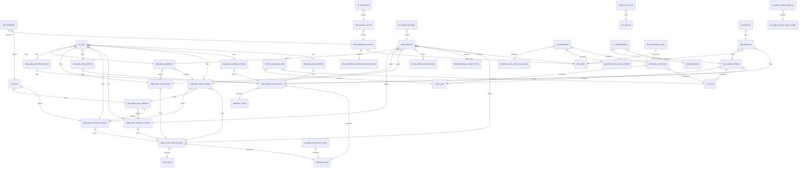

Certainly! Here's the complete document with the incorporated entity-relationship diagram information:

---

**Title:** GitHub - stinkgen/trino_mcp: MCP Server for Trino

**URL Source:** [GitHub Repository](https://github.com/stinkgen/trino_mcp)

**Objective:** Reimplement the Trino MCP Server in Go using the MCP SDK.

**Overview:**

The Trino MCP Server provides a Model Context Protocol (MCP) server for Trino, enabling AI models to access Trino's distributed SQL query engine. Trino, formerly known as PrestoSQL, is a powerful distributed SQL query engine designed for fast analytics on large datasets, particularly beneficial in the adtech industry. The current implementation is in Python, and the goal is to reimplement it in Go using the MCP SDK from [mark3labs/mcp-go](https://github.com/mark3labs/mcp-go).

**Key Features to Implement:**

1. **Server Initialization:**
   - Create an MCP server using Go.
   - Ensure compatibility with Trino's distributed SQL query engine.

2. **API Exposure:**
   - Implement REST API endpoints for querying Trino.
   - Support both Docker container API and standalone server options.

3. **LLM Integration:**
   - Enable LLMs to query and analyze data in Trino.
   - Provide command-line and REST API interfaces for LLMs.

4. **Transport Options:**
   - Implement reliable STDIO transport.
   - Address known issues with SSE transport.

5. **Testing and Validation:**
   - Develop comprehensive test scripts to validate API functionality.
   - Ensure robust error handling and query execution.

**Adtech Data Exploration with Trino:**

- **Types of Data:**
  - Impression, Click, Conversion, User, Campaign Performance, Publisher, Bid, Geolocation, Device, and Browser Data.

- **Trends and Insights:**
  - Audience Segmentation, Ad Performance Analysis, Attribution Modeling, Fraud Detection, Real-Time Bidding Efficiency, Cross-Channel Analysis, Seasonal Trends, User Engagement Trends, Geographical Performance, Device, and Platform Trends.

**What LLMs Can Achieve with Trino:**

- **Scalable Data Analysis:** LLMs can leverage Trino's ability to handle large datasets across distributed systems, enabling comprehensive analysis of vast adtech data.
- **Real-Time Insights:** By utilizing Trino's fast query capabilities, LLMs can provide real-time analytics and insights, facilitating immediate decision-making.
- **Unified Data Access:** LLMs can query data from multiple sources through Trino, offering a cohesive view of diverse datasets such as Hadoop, S3, and various databases.
- **SQL-Based Interactions:** With Trino's SQL compatibility, LLMs can easily generate and execute complex queries, making data exploration intuitive and efficient for data analysts.

**Entity-Relationship Diagram:**

**Development Steps:**

1. **Setup Go Environment:**
   - Install Go and clone the MCP SDK repository.
   - Familiarize yourself with the MCP SDK's core concepts and examples.

2. **Server Implementation:**
   - Use the MCP SDK to create a new MCP server in Go.
   - Implement the necessary tools and resources to interact with Trino.

3. **API Development:**
   - Develop REST API endpoints for executing SQL queries.
   - Ensure the API supports both Docker and standalone deployments.

4. **Testing and Debugging:**
   - Write and run tests to ensure the server's functionality.
   - Address any issues related to transport methods and API responses.

5. **Documentation:**
   - Document the Go implementation, including setup instructions and usage examples.
   - Provide clear guidelines for integrating with LLMs.

**Resources:**

- [Trino MCP Server Documentation](https://github.com/stinkgen/trino_mcp)
- [MCP Go SDK Documentation](https://github.com/mark3labs/mcp-go)

**Future Enhancements:**

- Integrate with newer MCP versions to resolve transport issues.
- Expand support for additional data types and Trino features.
- Enhance error handling and user authentication mechanisms.

---

This document provides a comprehensive guide for reimplementing the Trino MCP Server in Go, highlighting the benefits of Trino in the adtech industry, outlining the development process, and illustrating the relationships between different data entities.