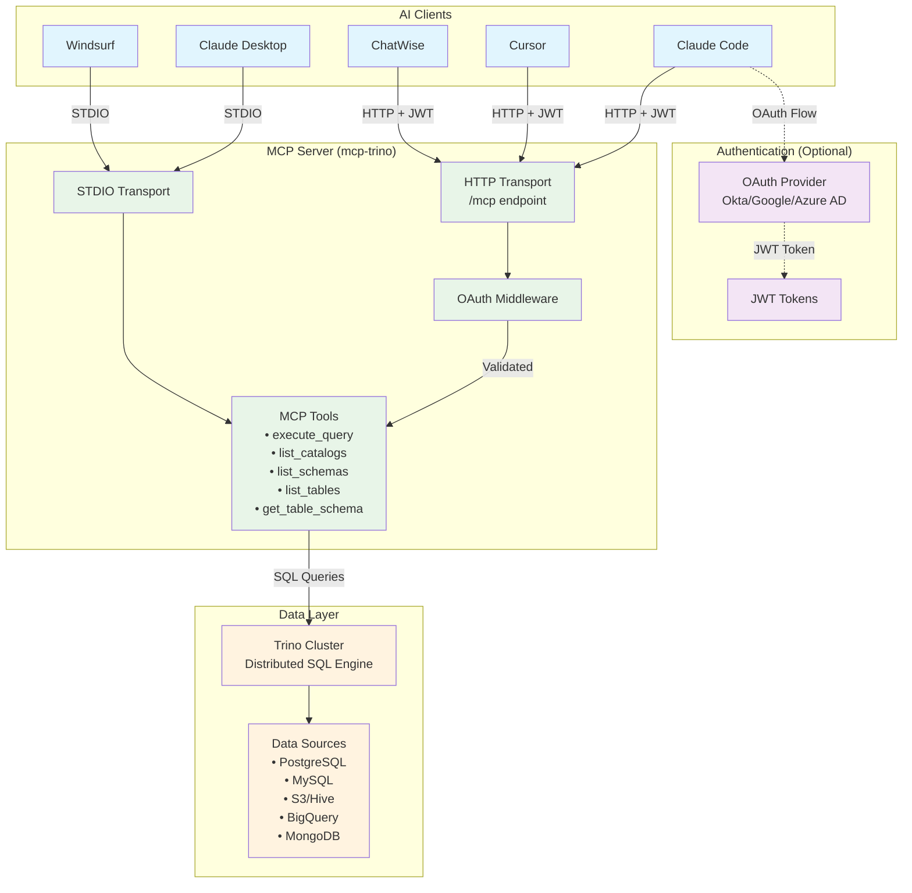

# Trino MCP Server in Go

A high-performance Model Context Protocol (MCP) server for Trino implemented in Go. This project enables AI assistants to seamlessly interact with Trino's distributed SQL query engine through standardized MCP tools.

[](https://github.com/tuannvm/mcp-trino/actions/workflows/build.yml)
[](https://github.com/tuannvm/mcp-trino/blob/main/go.mod)
[](https://github.com/tuannvm/mcp-trino/actions/workflows/build.yml)
[](https://slsa.dev)
[](https://goreportcard.com/report/github.com/tuannvm/mcp-trino)
[](https://pkg.go.dev/github.com/tuannvm/mcp-trino)
[](https://github.com/tuannvm/mcp-trino/pkgs/container/mcp-trino)
[](https://github.com/tuannvm/mcp-trino/releases/latest)
[](https://opensource.org/licenses/MIT)

[](https://archestra.ai/mcp-catalog/tuannvm__mcp-trino)


## Overview

This project implements a Model Context Protocol (MCP) server for Trino in Go. It enables AI assistants to access Trino's distributed SQL query engine through standardized MCP tools.

Trino (formerly PrestoSQL) is a powerful distributed SQL query engine designed for fast analytics on large datasets.

## Architecture



**Key Components:**
- **AI Clients**: Various MCP-compatible applications
- **Authentication**: Optional OAuth 2.0 with OIDC providers
- **MCP Server**: Go-based server with dual transport support
- **Data Layer**: Trino cluster connecting to multiple data sources

## Features

- ✅ MCP server implementation in Go
- ✅ Trino SQL query execution through MCP tools
- ✅ Catalog, schema, and table discovery
- ✅ Docker container support
- ✅ Supports both STDIO and HTTP transports
- ✅ OAuth 2.0 authentication with OIDC provider support (Okta, Google, Azure AD)
- ✅ StreamableHTTP support with JWT authentication (upgraded from SSE)
- ✅ Backward compatibility with SSE endpoints
- ✅ Compatible with Cursor, Claude Desktop, Windsurf, ChatWise, and any MCP-compatible clients.

## Installation

### Quick Install (One-liner)

For macOS and Linux, install with a single command:

```bash
curl -fsSL https://raw.githubusercontent.com/tuannvm/mcp-trino/main/install.sh -o install.sh && chmod +x install.sh && ./install.sh
```

### Homebrew (macOS and Linux)

The easiest way to install mcp-trino is using Homebrew:

```bash
# Install mcp-trino
brew install tuannvm/mcp/mcp-trino
```

To update to the latest version:

```bash
brew update && brew upgrade mcp-trino
```

### Alternative Installation Methods

#### Manual Download

1. Download the appropriate binary for your platform from the [GitHub Releases](https://github.com/tuannvm/mcp-trino/releases) page.
2. Place the binary in a directory included in your PATH (e.g., `/usr/local/bin` on Linux/macOS)
3. Make it executable (`chmod +x mcp-trino` on Linux/macOS)

#### From Source

```bash
git clone https://github.com/tuannvm/mcp-trino.git
cd mcp-trino
make build
# Binary will be in ./bin/
```

## Downloads

You can download pre-built binaries for your platform:

| Platform | Architecture | Download Link |
|----------|--------------|---------------|
| macOS | x86_64 (Intel) | [Download](https://github.com/tuannvm/mcp-trino/releases/latest/download/mcp-trino-darwin-amd64) |
| macOS | ARM64 (Apple Silicon) | [Download](https://github.com/tuannvm/mcp-trino/releases/latest/download/mcp-trino-darwin-arm64) |
| Linux | x86_64 | [Download](https://github.com/tuannvm/mcp-trino/releases/latest/download/mcp-trino-linux-amd64) |
| Linux | ARM64 | [Download](https://github.com/tuannvm/mcp-trino/releases/latest/download/mcp-trino-linux-arm64) |
| Windows | x86_64 | [Download](https://github.com/tuannvm/mcp-trino/releases/latest/download/mcp-trino-windows-amd64.exe) |

Or see all available downloads on the [GitHub Releases](https://github.com/tuannvm/mcp-trino/releases) page.

### Installation Troubleshooting

If you encounter issues during installation:

**Common Issues:**
- **Binary not found in PATH**: The install script installs to `~/.local/bin` by default. Make sure this directory is in your PATH:
  ```bash
  export PATH="$HOME/.local/bin:$PATH"
  ```
  Add this to your shell profile (`.bashrc`, `.zshrc`, etc.) to make it permanent.

- **Permission denied**: If you get permission errors, ensure the install directory is writable:
  ```bash
  mkdir -p ~/.local/bin
  chmod 755 ~/.local/bin
  ```

- **Claude configuration not found**: If the install script doesn't detect your Claude installation:
  - For Claude Desktop: Check if the config file exists at the expected location
  - For Claude Code: Verify the `claude` command is available in PATH
  - Use the manual configuration instructions provided by the script

- **GitHub API rate limiting**: If you're hitting GitHub API rate limits:
  ```bash
  export GITHUB_TOKEN=your_github_token
  curl -fsSL https://raw.githubusercontent.com/tuannvm/mcp-trino/main/install.sh | bash
  ```

**Getting Help:**
- Check the [GitHub Issues](https://github.com/tuannvm/mcp-trino/issues) for similar problems
- Run the install script with `--help` for usage information
- Use manual installation methods if the automated script fails
## MCP Integration

This MCP server can be integrated with several AI applications:

### Using Docker Image

To use the Docker image instead of a local binary:

```json
{
  "mcpServers": {
    "mcp-trino": {
      "command": "docker",
      "args": ["run", "--rm", "-i",
               "-e", "TRINO_HOST=<HOST>",
               "-e", "TRINO_PORT=<PORT>",
               "-e", "TRINO_USER=<USERNAME>",
               "-e", "TRINO_PASSWORD=<PASSWORD>",
               "-e", "TRINO_SCHEME=http",
               "ghcr.io/tuannvm/mcp-trino:latest"],
      "env": {}
    }
  }
}
```

> **Note**: The `host.docker.internal` special DNS name allows the container to connect to services running on the host machine. If your Trino server is running elsewhere, replace with the appropriate host.

This Docker configuration can be used in any of the below applications.

### Cursor

To use with [Cursor](https://cursor.sh/), create or edit `~/.cursor/mcp.json`:

```json
{
  "mcpServers": {
    "mcp-trino": {
      "command": "mcp-trino",
      "args": [],
      "env": {
        "TRINO_HOST": "<HOST>",
        "TRINO_PORT": "<PORT>",
        "TRINO_USER": "<USERNAME>",
        "TRINO_PASSWORD": "<PASSWORD>"
      }
    }
  }
}
```

Replace the environment variables with your specific Trino configuration.

For HTTP+StreamableHTTP transport mode (recommended for web clients):

```json
{
  "mcpServers": {
    "mcp-trino-http": {
      "url": "http://localhost:8080/mcp"
    }
  }
}
```

For remote MCP server with JWT authentication:

```json
{
  "mcpServers": {
    "mcp-trino-remote": {
      "url": "https://your-mcp-server.com/mcp",
      "headers": {
        "Authorization": "Bearer YOUR_JWT_TOKEN"
      }
    }
  }
}
```

For backward compatibility with SSE (legacy endpoint):

```json
{
  "mcpServers": {
    "mcp-trino-sse": {
      "url": "http://localhost:8080/sse"
    }
  }
}
```

Then start the server in a separate terminal with:

```bash
# Basic HTTP transport
MCP_TRANSPORT=http TRINO_HOST=<HOST> TRINO_PORT=<PORT> TRINO_USER=<USERNAME> TRINO_PASSWORD=<PASSWORD> mcp-trino

# With JWT authentication enabled
MCP_TRANSPORT=http TRINO_OAUTH_ENABLED=true TRINO_HOST=<HOST> TRINO_PORT=<PORT> TRINO_USER=<USERNAME> TRINO_PASSWORD=<PASSWORD> mcp-trino

# Production deployment with HTTPS
MCP_TRANSPORT=http TRINO_OAUTH_ENABLED=true HTTPS_CERT_FILE=/path/to/cert.pem HTTPS_KEY_FILE=/path/to/key.pem TRINO_HOST=<HOST> TRINO_PORT=<PORT> TRINO_USER=<USERNAME> TRINO_PASSWORD=<PASSWORD> mcp-trino
```

### Claude Desktop

To use with [Claude Desktop](https://claude.ai/desktop), the easiest way is to use the install script which will automatically configure it for you. Alternatively, you can manually edit your Claude configuration file:

- macOS: `~/Library/Application Support/Claude/claude_desktop_config.json`
- Windows: `%APPDATA%\Claude\claude_desktop_config.json`
- Linux: `~/.config/Claude/claude_desktop_config.json`

```json
{
  "mcpServers": {
    "mcp-trino": {
      "command": "mcp-trino",
      "args": [],
      "env": {
        "TRINO_HOST": "<HOST>",
        "TRINO_PORT": "<PORT>",
        "TRINO_USER": "<USERNAME>",
        "TRINO_PASSWORD": "<PASSWORD>"
      }
    }
  }
}
```

After updating the configuration, restart Claude Desktop. You should see the MCP tools available in the tools menu.

### Claude Code

To use with [Claude Code](https://claude.ai/code), the install script will automatically configure it for you. Alternatively, you can manually add the MCP server:

```bash
claude mcp add mcp-trino mcp-trino
```

Then set your environment variables:

```bash
export TRINO_HOST=<HOST>
export TRINO_PORT=<PORT>
export TRINO_USER=<USERNAME>
export TRINO_PASSWORD=<PASSWORD>
```

Restart Claude Code to see the MCP tools available.

### Windsurf

To use with [Windsurf](https://windsurf.com/refer?referral_code=sjqdvqozgx2wyi7r), create or edit your `mcp_config.json`:

```json
{
  "mcpServers": {
    "mcp-trino": {
      "command": "mcp-trino",
      "args": [],
      "env": {
        "TRINO_HOST": "<HOST>",
        "TRINO_PORT": "<PORT>",
        "TRINO_USER": "<USERNAME>",
        "TRINO_PASSWORD": "<PASSWORD>"
      }
    }
  }
}
```

Restart Windsurf to apply the changes. The Trino MCP tools will be available to the Cascade AI.

### ChatWise

To use with [ChatWise](https://chatwise.app?atp=uo1wzc), follow these steps:

**Local MCP Server:**
1. Open ChatWise and go to Settings
2. Navigate to the Tools section
3. Click the "+" icon to add a new tool
4. Select "Command Line MCP"
5. Configure with the following details:
   - ID: `mcp-trino` (or any name you prefer)
   - Command: `mcp-trino`
   - Args: (leave empty)
   - Env: Add the following environment variables:
     ```
     TRINO_HOST=<HOST>
     TRINO_PORT=<PORT>
     TRINO_USER=<USERNAME>
     TRINO_PASSWORD=<PASSWORD>
     ```

**Remote MCP Server:**
For remote MCP servers with JWT authentication:

1. Copy this JSON to your clipboard:
   ```json
   {
     "mcpServers": {
       "remote-trino": {
         "url": "https://your-mcp-server.com/mcp",
         "headers": {
           "Authorization": "Bearer YOUR_JWT_TOKEN"
         }
       }
     }
   }
   ```
2. In ChatWise Settings > Tools, click the "+" icon
3. Select "Import JSON from Clipboard"
4. Toggle the switch next to the tool to enable it

Alternatively, you can import the local configuration from JSON:

1. Copy this JSON to your clipboard:
   ```json
   {
     "mcpServers": {
       "mcp-trino": {
         "command": "mcp-trino",
         "args": [],
         "env": {
           "TRINO_HOST": "<HOST>",
           "TRINO_PORT": "<PORT>",
           "TRINO_USER": "<USERNAME>",
           "TRINO_PASSWORD": "<PASSWORD>"
         }
       }
     }
   }
   ```
2. In ChatWise Settings > Tools, click the "+" icon
3. Select "Import JSON from Clipboard"
4. Toggle the switch next to the tool to enable it

Once enabled, click the hammer icon below the input box in ChatWise to access Trino MCP tools.

## Available MCP Tools

The server provides the following MCP tools:

### execute_query

Execute a SQL query against Trino with full SQL support for complex analytical queries.

**Sample Prompt:**
> "How many customers do we have per region? Can you show them in descending order?"

**Example:**
```json
{
  "query": "SELECT region, COUNT(*) as customer_count FROM tpch.tiny.customer GROUP BY region ORDER BY customer_count DESC"
}
```

**Response:**
```json
{
  "columns": ["region", "customer_count"],
  "data": [
    ["AFRICA", 5],
    ["AMERICA", 5],
    ["ASIA", 5],
    ["EUROPE", 5],
    ["MIDDLE EAST", 5]
  ]
}
```

### list_catalogs

List all catalogs available in the Trino server, providing a comprehensive view of your data ecosystem.

**Sample Prompt:**
> "What databases do we have access to in our Trino environment?"

**Example:**
```json
{}
```

**Response:**
```json
{
  "catalogs": ["tpch", "memory", "system", "jmx"]
}
```

### list_schemas

List all schemas in a catalog, helping you navigate through the data hierarchy efficiently.

**Sample Prompt:**
> "What schemas or datasets are available in the tpch catalog?"

**Example:**
```json
{
  "catalog": "tpch"
}
```

**Response:**
```json
{
  "schemas": ["information_schema", "sf1", "sf100", "sf1000", "tiny"]
}
```

### list_tables

List all tables in a schema, giving you visibility into available datasets.

**Sample Prompt:**
> "What tables are available in the tpch tiny schema? I need to know what data we can query."

**Example:**
```json
{
  "catalog": "tpch",
  "schema": "tiny"
}
```

**Response:**
```json
{
  "tables": ["customer", "lineitem", "nation", "orders", "part", "partsupp", "region", "supplier"]
}
```

### get_table_schema

Get the schema of a table, understanding the structure of your data for better query planning.

**Sample Prompt:**
> "What columns are in the customer table? I need to know the data types and structure before writing my query."

**Example:**
```json
{
  "catalog": "tpch",
  "schema": "tiny",
  "table": "customer"
}
```

**Response:**
```json
{
  "columns": [
    {
      "name": "custkey",
      "type": "bigint",
      "nullable": false
    },
    {
      "name": "name",
      "type": "varchar",
      "nullable": false
    },
    {
      "name": "address",
      "type": "varchar",
      "nullable": false
    },
    {
      "name": "nationkey",
      "type": "bigint",
      "nullable": false
    },
    {
      "name": "phone",
      "type": "varchar",
      "nullable": false
    },
    {
      "name": "acctbal",
      "type": "double",
      "nullable": false
    },
    {
      "name": "mktsegment",
      "type": "varchar",
      "nullable": false
    },
    {
      "name": "comment",
      "type": "varchar",
      "nullable": false
    }
  ]
}
```

This information is invaluable for understanding the column names, data types, and nullability constraints before writing queries against the table.

## End-to-End Example

Here's a complete interaction example showing how an AI assistant might use these tools to answer a business question:

**User Query:** "Can you help me analyze our biggest customers? I want to know the top 5 customers with the highest account balances."

**AI Assistant's workflow:**
1. First, discover available catalogs
   ```
   > Using list_catalogs tool
   > Discovers tpch catalog
   ```

2. Then, find available schemas
   ```
   > Using list_schemas tool with catalog "tpch"
   > Discovers "tiny" schema
   ```

3. Explore available tables
   ```
   > Using list_tables tool with catalog "tpch" and schema "tiny"
   > Finds "customer" table
   ```

4. Check the customer table schema
   ```
   > Using get_table_schema tool
   > Discovers "custkey", "name", "acctbal" and other columns
   ```

5. Finally, execute the query
   ```
   > Using execute_query tool with:
   > "SELECT custkey, name, acctbal FROM tpch.tiny.customer ORDER BY acctbal DESC LIMIT 5"
   ```

6. Returns the results to the user:
   ```
   The top 5 customers with highest account balances are:
   1. Customer #65 (Customer#000000065): $9,222.78
   2. Customer #13 (Customer#000000013): $8,270.47
   3. Customer #89 (Customer#000000089): $7,990.56
   4. Customer #11 (Customer#000000011): $7,912.91
   5. Customer #82 (Customer#000000082): $7,629.41
   ```

This seamless workflow demonstrates how the MCP tools enable AI assistants to explore and query data in a conversational manner.

## Authentication and Transport

### Transport Methods

The server supports two transport methods:

#### STDIO Transport (Default)
- Direct integration with MCP clients
- Ideal for desktop applications like Claude Desktop
- Uses standard input/output for communication

#### HTTP Transport with StreamableHTTP
- **Modern approach**: Uses the `/mcp` endpoint with StreamableHTTP protocol
- **Legacy support**: Maintains `/sse` endpoint for backward compatibility with SSE
- Supports web-based MCP clients
- Enables JWT authentication for secure access

### OAuth 2.0 Authentication

✅ **Production-Ready**: Complete OAuth 2.0 implementation with OIDC provider support for secure remote deployments.

**Supported Authentication Modes:**

1. **OIDC Provider Mode** (Production - Recommended)
   ```bash
   # Configure with OAuth provider (Okta example)
   export TRINO_OAUTH_ENABLED=true
   export OAUTH_PROVIDER=okta
   export OIDC_ISSUER=https://your-domain.okta.com
   export OIDC_AUDIENCE=https://your-domain.okta.com
   export MCP_TRANSPORT=http
   mcp-trino
   ```

2. **HMAC Mode** (Development/Testing)
   ```bash
   # Simple JWT with shared secret
   export TRINO_OAUTH_ENABLED=true
   export OAUTH_PROVIDER=hmac
   export JWT_SECRET=your-secret-key-here
   export MCP_TRANSPORT=http
   mcp-trino
   ```

**Key Features:**
- **Multiple Providers**: Okta, Google, Azure AD, and custom OIDC providers
- **JWKS Validation**: Automatic key rotation and signature verification
- **Token Caching**: Performance optimization with 5-minute cache expiration
- **MCP Compliance**: Full OAuth 2.1 and MCP authorization specification support

Client requests must include the JWT token in the Authorization header:
```http
Authorization: Bearer <your-jwt-token>
```

For detailed OAuth configuration and deployment examples, see [docs/oauth.md](docs/oauth.md).

### HTTPS Support

For production deployments with authentication, HTTPS is strongly recommended:

```bash
export HTTPS_CERT_FILE=/path/to/certificate.pem
export HTTPS_KEY_FILE=/path/to/private-key.pem
export TRINO_OAUTH_ENABLED=true
export MCP_TRANSPORT=http
mcp-trino
```

The server will automatically start with HTTPS when certificate files are provided.

## Remote MCP Server Deployment

Since the server supports JWT authentication and HTTP transport, you can deploy it as a remote MCP server accessible to multiple clients over the network.

> **Important**: When deploying a remote MCP server (behind a load balancer, reverse proxy, or with a public domain), you must set `MCP_URL` to the public base URL of your MCP server (including scheme and port if non-standard). This value is used in OAuth metadata and printed endpoints so clients discover the correct URLs.

### Production Deployment Example

```bash
# Deploy with HTTPS and JWT authentication
export MCP_TRANSPORT=http
export MCP_PORT=443
export MCP_URL=https://your-mcp-server.com
export TRINO_OAUTH_ENABLED=true
export HTTPS_CERT_FILE=/etc/ssl/certs/mcp-trino.pem
export HTTPS_KEY_FILE=/etc/ssl/private/mcp-trino.key
export TRINO_HOST=your-trino-cluster.com
export TRINO_PORT=443
export TRINO_USER=service-account
export TRINO_PASSWORD=service-password

# Start the server
mcp-trino
```

### Client Configuration for Remote Server

**With JWT Authentication:**
```json
{
  "mcpServers": {
    "remote-trino": {
      "url": "https://your-mcp-server.com/mcp",
      "headers": {
        "Authorization": "Bearer YOUR_JWT_TOKEN"
      }
    }
  }
}
```

**Load Balancer/Proxy Configuration:**
```nginx
server {
    listen 443 ssl;
    server_name your-mcp-server.com;
    
    ssl_certificate /etc/ssl/certs/mcp-trino.pem;
    ssl_certificate_key /etc/ssl/private/mcp-trino.key;
    
    location /mcp {
        proxy_pass http://localhost:8080;
        proxy_set_header Host $host;
        proxy_set_header X-Real-IP $remote_addr;
        proxy_set_header Authorization $http_authorization;
        proxy_http_version 1.1;
        proxy_set_header Upgrade $http_upgrade;
        proxy_set_header Connection "upgrade";
    }
}
```

### Docker Deployment

For containerized deployment:

```dockerfile
FROM ghcr.io/tuannvm/mcp-trino:latest

ENV MCP_TRANSPORT=http
ENV MCP_PORT=8080
ENV TRINO_OAUTH_ENABLED=true
ENV TRINO_HOST=your-trino-cluster.com
ENV TRINO_PORT=443
ENV TRINO_USER=service-account
ENV TRINO_PASSWORD=service-password

EXPOSE 8080

CMD ["mcp-trino"]
```

```bash
# Build and run with Docker
docker build -t mcp-trino-server .
docker run -d -p 8080:8080 \
  -e HTTPS_CERT_FILE=/certs/cert.pem \
  -e HTTPS_KEY_FILE=/certs/key.pem \
  -v /path/to/certs:/certs \
  mcp-trino-server
```

### Security Considerations

- **JWT Token Management**: Implement proper token rotation and validation
- **Network Security**: Use HTTPS in production and consider network-level security
- **Access Control**: Implement proper authentication and authorization mechanisms
- **Monitoring**: Set up logging and monitoring for security events
- **Token Security**: 
  - Never commit JWT secrets to version control
  - Use strong, randomly generated secrets (minimum 256 bits)
  - Implement short token expiration times with refresh mechanisms
  - Store tokens securely in client applications
- **Production Recommendations**:
  - Use asymmetric algorithms (RS256, ES256) instead of HS256
  - Implement proper issuer (`iss`) and audience (`aud`) validation
  - Use established OAuth 2.1/OpenID Connect providers
  - Implement token revocation mechanisms

### Quick Start with OAuth

**For Production (OIDC):**
```bash
# Configure OAuth provider
export TRINO_OAUTH_ENABLED=true
export OAUTH_PROVIDER=okta
export OIDC_ISSUER=https://your-domain.okta.com
export OIDC_AUDIENCE=https://your-domain.okta.com
export MCP_TRANSPORT=http

# Start server
mcp-trino
```

**For Development (HMAC):**
```bash
# Simple JWT testing
export TRINO_OAUTH_ENABLED=true
export OAUTH_PROVIDER=hmac
export JWT_SECRET="your-test-secret"
export MCP_TRANSPORT=http

# Start server
mcp-trino
```

**Client Configuration:**
```json
{
  "mcpServers": {
    "trino-oauth": {
      "url": "https://your-mcp-server.com/mcp",
      "headers": {
        "Authorization": "Bearer YOUR_JWT_TOKEN"
      }
    }
  }
}
```

## Configuration

The server can be configured using the following environment variables:

| Variable               | Description                       | Default   |
| ---------------------- | --------------------------------- | --------- |
| TRINO_HOST             | Trino server hostname             | localhost |
| TRINO_PORT             | Trino server port                 | 8080      |
| TRINO_USER             | Trino user                        | trino     |
| TRINO_PASSWORD         | Trino password                    | (empty)   |
| TRINO_CATALOG          | Default catalog                   | memory    |
| TRINO_SCHEMA           | Default schema                    | default   |
| TRINO_SCHEME           | Connection scheme (http/https)    | https     |
| TRINO_SSL              | Enable SSL                        | true      |
| TRINO_SSL_INSECURE     | Allow insecure SSL                | true      |
| TRINO_ALLOW_WRITE_QUERIES | Allow non-read-only SQL queries | false     |
| TRINO_QUERY_TIMEOUT    | Query timeout in seconds          | 30        |
| MCP_TRANSPORT          | Transport method (stdio/http)     | stdio     |
| MCP_PORT               | HTTP port for http transport      | 8080      |
| MCP_HOST               | Host for HTTP callbacks           | localhost |
| MCP_URL                | Public base URL of MCP server (used for OAuth metadata and client discovery); required for remote deployments | http://localhost:8080 |
| TRINO_OAUTH_ENABLED    | Enable OAuth authentication       | false     |
| OAUTH_PROVIDER         | OAuth provider (hmac/okta/google/azure) | hmac   |
| JWT_SECRET             | JWT secret for HMAC mode          | (empty)   |
| OIDC_ISSUER            | OIDC provider issuer URL          | (empty)   |
| OIDC_AUDIENCE          | OIDC audience identifier           | (empty)   |
| OIDC_CLIENT_ID         | OIDC client ID                     | (empty)   |
| HTTPS_CERT_FILE        | Path to HTTPS certificate file    | (empty)   |
| HTTPS_KEY_FILE         | Path to HTTPS private key file    | (empty)   |

> **Note**: When `TRINO_SCHEME` is set to "https", `TRINO_SSL` is automatically set to true regardless of the provided value.

> **Important**: The default connection mode is HTTPS. If you're using an HTTP-only Trino server, you must set `TRINO_SCHEME=http` in your environment variables.

> **Security Note**: By default, only read-only queries (SELECT, SHOW, DESCRIBE, EXPLAIN) are allowed to prevent SQL injection. If you need to execute write operations or other non-read queries, set `TRINO_ALLOW_WRITE_QUERIES=true`, but be aware this bypasses this security protection.

> **For Web Client Integration**: When using with web clients, set `MCP_TRANSPORT=http` and connect to the `/mcp` endpoint for StreamableHTTP support. The `/sse` endpoint is maintained for backward compatibility.

> **OAuth Authentication**: When `TRINO_OAUTH_ENABLED=true`, the server supports multiple OAuth providers including OIDC-compliant providers (Okta, Google, Azure AD) for production use and HMAC mode for development/testing.

> **HTTPS Support**: For production deployments, configure HTTPS by setting `HTTPS_CERT_FILE` and `HTTPS_KEY_FILE` environment variables. This is strongly recommended when using JWT authentication.

## Contributing

Contributions are welcome! Please feel free to submit a Pull Request.

## License

This project is licensed under the MIT License - see the LICENSE file for details.

## CI/CD and Releases

This project uses GitHub Actions for continuous integration and GoReleaser for automated releases.

### Continuous Integration Checks

Our CI pipeline performs the following checks on all PRs and commits to the main branch:

#### Code Quality
- **Linting**: Using golangci-lint to check for common code issues and style violations
- **Go Module Verification**: Ensuring go.mod and go.sum are properly maintained
- **Formatting**: Verifying code is properly formatted with gofmt

#### Security
- **Vulnerability Scanning**: Using govulncheck to check for known vulnerabilities in dependencies
- **Dependency Scanning**: Using Trivy to scan for vulnerabilities in dependencies (CRITICAL, HIGH, and MEDIUM)
- **SBOM Generation**: Creating a Software Bill of Materials for dependency tracking
- **SLSA Provenance**: Creating verifiable build provenance for supply chain security

#### Testing
- **Unit Tests**: Running tests with race detection and code coverage reporting
- **Build Verification**: Ensuring the codebase builds successfully

#### CI/CD Security
- **Least Privilege**: Workflows run with minimum required permissions
- **Pinned Versions**: All GitHub Actions use specific versions to prevent supply chain attacks
- **Dependency Updates**: Automated dependency updates via Dependabot

### Release Process

When changes are merged to the main branch:

1. CI checks are run to validate code quality and security
2. If successful, a new release is automatically created with:
   - Semantic versioning based on commit messages
   - Binary builds for multiple platforms
   - Docker image publishing to GitHub Container Registry
   - SBOM and provenance attestation
