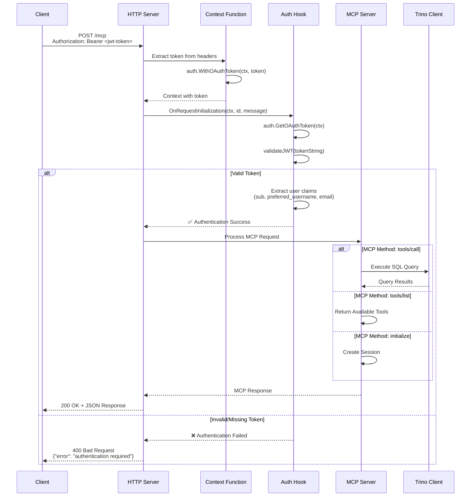

# JWT Authentication Implementation

This document describes the JWT-based OAuth 2.1 authentication implementation for mcp-trino server.

## Overview

The mcp-trino server implements OAuth 2.1 authentication using JWT Bearer tokens with server-level request interception. This ensures **complete API protection** for all MCP methods, not just tool execution.

## Architecture

### Authentication Flow



**Flow Steps:**

1. **HTTP Request**: Client sends request with `Authorization: Bearer <jwt-token>` header
2. **Context Injection**: `WithHTTPContextFunc` extracts token from headers into request context
3. **Server-Level Authentication**: `OnRequestInitialization` hook validates token before any processing
4. **Method Execution**: If authenticated, request proceeds to appropriate MCP handler

### Security Model

- **Complete API Protection**: ALL MCP methods require authentication
- **Server-Level Enforcement**: Authentication applied before method-specific processing
- **JWT Validation**: Simplified JWT parsing with claims extraction
- **Context-Based**: Token and user info stored in request context

## Implementation Details

### 1. Configuration

OAuth is controlled via environment variables:

```bash
TRINO_OAUTH_ENABLED=true  # Enable OAuth authentication
JWT_SECRET=your-secret-key  # JWT signing secret (REQUIRED - no default)
```

### 2. Context Management

**Token Injection** (`cmd/main.go`):
```go
contextFunc := func(ctx context.Context, r *http.Request) context.Context {
    authHeader := r.Header.Get("Authorization")
    if strings.HasPrefix(authHeader, "Bearer ") {
        token := strings.TrimPrefix(authHeader, "Bearer ")
        token = strings.TrimSpace(token)
        ctx = auth.WithOAuthToken(ctx, token)
        log.Printf("OAuth: Token extracted from request (length: %d)", len(token))
    }
    return ctx
}
```

**Shared Context Keys** (`internal/auth/oauth.go`):
```go
type contextKey string

const (
    oauthTokenKey contextKey = "oauth_token"
    userContextKey contextKey = "user"
)

func WithOAuthToken(ctx context.Context, token string) context.Context {
    return context.WithValue(ctx, oauthTokenKey, token)
}

func GetOAuthToken(ctx context.Context) (string, bool) {
    token, ok := ctx.Value(oauthTokenKey).(string)
    return token, ok
}
```

### 3. Server-Level Authentication

**Request Initialization Hook** (`internal/auth/oauth.go`):
```go
func CreateRequestAuthHook() func(context.Context, interface{}, interface{}) error {
    return func(ctx context.Context, id interface{}, message interface{}) error {
        // Use shared authentication function (DRY principle)
        user, err := authenticateRequest(ctx)
        if err != nil {
            return fmt.Errorf("authentication failed: %w", err)
        }

        log.Printf("OAuth: Authenticated user %s for request ID: %v", user.Username, id)
        return nil // Allow request to proceed
    }
}
```

**Consolidated Authentication Function** (`internal/auth/oauth.go`):
```go
func authenticateRequest(ctx context.Context) (*User, error) {
    // Extract token from context
    tokenString, ok := GetOAuthToken(ctx)
    if !ok {
        return nil, fmt.Errorf("authentication required: missing OAuth token")
    }

    // Validate JWT token with proper signature verification
    user, err := validateJWT(tokenString)
    if err != nil {
        return nil, fmt.Errorf("authentication failed: %w", err)
    }

    return user, nil
}
```

**Server Configuration** (`cmd/main.go`):
```go
// Create hooks for server-level authentication
hooks := &server.Hooks{}
if trinoConfig.OAuthEnabled {
    hooks.AddOnRequestInitialization(auth.CreateRequestAuthHook())
}

mcpServer := server.NewMCPServer("Trino MCP Server", Version,
    server.WithToolCapabilities(true),
    server.WithHooks(hooks),
)
```

### 4. JWT Validation

**Secure JWT Parser with Signature Verification** (`internal/auth/oauth.go`):
```go
func validateJWT(tokenString string) (*User, error) {
    // Remove Bearer prefix if present
    tokenString = strings.TrimPrefix(tokenString, "Bearer ")
    
    // Get cached JWT secret
    secret, err := getJWTSecret()
    if err != nil {
        return nil, fmt.Errorf("JWT secret not configured: %w", err)
    }

    // Parse JWT with proper signature verification
    token, err := jwt.Parse(tokenString, func(token *jwt.Token) (interface{}, error) {
        if _, ok := token.Method.(*jwt.SigningMethodHMAC); !ok {
            return nil, fmt.Errorf("unexpected signing method: %v", token.Header["alg"])
        }
        return []byte(secret), nil
    })

    if err != nil {
        return nil, fmt.Errorf("failed to parse token: %w", err)
    }

    claims, ok := token.Claims.(jwt.MapClaims)
    if !ok || !token.Valid {
        return nil, fmt.Errorf("invalid token claims")
    }

    // Validate required claims
    if err := validateJWTClaims(claims); err != nil {
        return nil, fmt.Errorf("invalid token claims: %w", err)
    }

    // Extract user information
    user := &User{
        Subject:  getStringClaim(claims, "sub"),
        Username: getStringClaim(claims, "preferred_username"),
        Email:    getStringClaim(claims, "email"),
    }

    if user.Subject == "" {
        return nil, fmt.Errorf("missing subject in token")
    }

    return user, nil
}
```

**JWT Secret Caching** (`internal/auth/oauth.go`):
```go
var (
    jwtSecret     string
    jwtSecretOnce sync.Once
)

func getJWTSecret() (string, error) {
    jwtSecretOnce.Do(func() {
        jwtSecret = os.Getenv("JWT_SECRET")
    })
    
    if jwtSecret == "" {
        return "", fmt.Errorf("JWT_SECRET environment variable is required")
    }
    
    return jwtSecret, nil
}
```

### 5. StreamableHTTP Integration

**Modern HTTP Transport** (`cmd/main.go`):
```go
// Create StreamableHTTP server instance
streamableServer := server.NewStreamableHTTPServer(
    mcpServer,
    server.WithEndpointPath("/mcp"),
    server.WithHTTPContextFunc(contextFunc),
    server.WithStateLess(false), // Enable session management
)
```

## Protected API Surface

With the server-level authentication hook, **ALL MCP methods** are now protected:

- ✅ `initialize` - Session establishment  
- ✅ `tools/list` - List available tools
- ✅ `tools/call` - Execute tools
- ✅ `resources/list` - List available resources
- ✅ `resources/read` - Read resources
- ✅ `prompts/list` - List available prompts
- ✅ `prompts/get` - Get prompt templates
- ✅ **All other MCP methods**

## Testing

### Generate Test Token

```bash
go run examples/generate_token.go
```

### Test Authentication

```bash
# Complete authentication test
./test_server_auth.sh
```

**Expected Results**:
- ❌ **Unauthenticated requests**: Blocked with "authentication required"
- ✅ **Authenticated requests**: Allowed with proper JWT token

### Manual Testing

```bash
# Valid token test
curl -X POST https://localhost:8080/mcp \
  -H "Authorization: Bearer <jwt-token>" \
  -H "Content-Type: application/json" \
  -d '{"jsonrpc":"2.0","id":1,"method":"tools/list","params":{}}' \
  -k

# Invalid token test (should fail)
curl -X POST https://localhost:8080/mcp \
  -H "Content-Type: application/json" \
  -d '{"jsonrpc":"2.0","id":1,"method":"tools/list","params":{}}' \
  -k
```

## Client Configuration

### Claude Code Configuration

The server supports both modern and legacy endpoints for backward compatibility:

**Modern endpoint (recommended):**
```json
{
  "mcpServers": {
    "trino-oauth": {
      "type": "http",
      "url": "https://localhost:8080/mcp",
      "headers": {
        "Authorization": "Bearer <your-jwt-token>"
      }
    }
  }
}
```

**Legacy endpoint (backward compatibility):**
```json
{
  "mcpServers": {
    "trino-oauth": {
      "type": "http", 
      "url": "https://localhost:8080/sse",
      "headers": {
        "Authorization": "Bearer <your-jwt-token>"
      }
    }
  }
}
```

Both endpoints provide identical functionality and security.

## Backward Compatibility

### Endpoint Support

The server maintains backward compatibility by supporting both endpoints:

| Endpoint | Status | Description |
|----------|---------|-------------|
| `/mcp` | ✅ **Recommended** | Modern StreamableHTTP endpoint |
| `/sse` | ✅ **Legacy Support** | Backward compatibility for existing clients |

### Migration Path

For existing clients using the `/sse` endpoint:

1. **No immediate changes required** - `/sse` endpoint continues to work
2. **Gradual migration** - Update clients to use `/mcp` when convenient  
3. **Same authentication** - Both endpoints use identical OAuth implementation
4. **Same functionality** - All MCP methods available on both endpoints

### Technical Implementation

Both endpoints are handled by the same `mcpHandler` function:

```go
// Shared MCP handler function for both endpoints
mcpHandler := func(w http.ResponseWriter, r *http.Request) {
    // Same CORS, authentication, and processing logic
    streamableServer.ServeHTTP(w, r)
}

// Add both endpoints
mux.HandleFunc("/mcp", mcpHandler)  // Modern
mux.HandleFunc("/sse", mcpHandler)  // Legacy
```

This ensures:
- **Identical behavior** across both endpoints
- **Single codebase** for maintenance
- **Consistent security** implementation

### Production Considerations

1. **HTTPS Required**: OAuth should always use HTTPS in production
2. **JWT Signature Verification**: ✅ **IMPLEMENTED** - Proper signature verification with HMAC-SHA256
3. **Token Expiration**: ✅ **IMPLEMENTED** - Proper token expiration checking with claims validation
4. **Rate Limiting**: Add rate limiting middleware after authentication
5. **Audit Logging**: Log all authentication attempts
6. **Security Improvements Applied**:
   - JWT secret caching with `sync.Once` pattern
   - No insecure default fallbacks
   - Consolidated authentication logic
   - Graceful HTTP server shutdown

## Security Features

### Complete API Protection

Unlike tool-only middleware approaches, this implementation provides:

- **Server-Level Security**: Authentication applied before any request processing
- **No Bypass Routes**: Every MCP method requires authentication
- **Early Termination**: Invalid requests rejected immediately
- **Context Propagation**: User information available throughout request lifecycle

### Error Handling

- **Clear Error Messages**: Descriptive authentication failure messages
- **Proper HTTP Status Codes**: Standard error codes for different failure types
- **Debug Logging**: Comprehensive logging for troubleshooting

## Migration Notes

### From Tool-Only Middleware

If migrating from `WithToolHandlerMiddleware` approach:

1. Remove tool-specific middleware configuration
2. Add server-level hooks with `OnRequestInitialization`
3. Test all MCP methods for proper authentication
4. Update client configurations to include authentication headers

### From SSE Transport

If migrating from Server-Sent Events:

1. Replace `NewSSEServer` with `NewStreamableHTTPServer`
2. Update client endpoints from `/sse` to `/mcp`
3. Update context functions from `WithSSEContextFunc` to `WithHTTPContextFunc`
4. Test session management compatibility

## Troubleshooting

### Common Issues

1. **"authentication required"**: Missing or malformed Authorization header
2. **"failed to parse token"**: JWT token corrupted (check for line breaks in curl commands)
3. **"missing subject in token"**: JWT missing required `sub` claim
4. **Session ID errors**: Ensure proper session establishment flow

### Debug Logging

Enable detailed OAuth logging by checking server output:

```
OAuth: Token extracted from request (length: 193)
OAuth: Received token for request ID 1: eyJhbGciOiJub25lIi...
OAuth: Authenticated user testuser for request ID: 1
```

## Implementation Status

- ✅ **Server-Level Authentication**: Complete API protection
- ✅ **JWT Validation**: Secure token parsing with proper signature verification
- ✅ **StreamableHTTP Transport**: Modern HTTP streaming
- ✅ **Session Management**: Proper MCP session handling
- ✅ **Context Management**: Shared context keys
- ✅ **Error Handling**: Descriptive error messages
- ✅ **Testing Framework**: Comprehensive test scripts
- ✅ **Client Integration**: Claude Code compatibility
- ✅ **Security Enhancements**: 
  - JWT secret caching with `sync.Once` pattern
  - Proper JWT signature verification (no ParseUnverified)
  - Consolidated authentication logic (DRY principle)
  - No insecure default fallbacks
  - Graceful HTTP server shutdown with timeout

The OAuth 2.1 implementation provides complete security for the mcp-trino server with modern transport, proper authentication for all MCP methods, and production-ready security features.