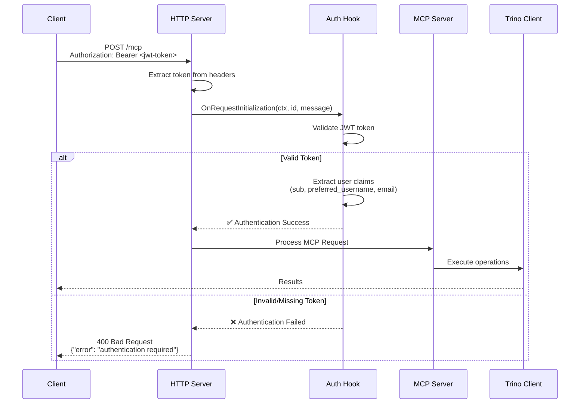

# JWT Authentication Implementation

This document describes the JWT-based authentication implementation for the mcp-trino server, providing secure access control at the server level.

## Overview

The mcp-trino server implements JWT Bearer token authentication with server-level request interception, ensuring **complete API protection** for all MCP methods. This approach provides security for the entire API surface, not just individual tools.

## Architecture

### Authentication Flow



**Key Flow Steps:**

1. **HTTP Request**: Client sends request with `Authorization: Bearer <jwt-token>` header
2. **Token Extraction**: Server extracts token from headers into request context
3. **Server-Level Authentication**: Authentication hook validates token before any processing
4. **Request Processing**: If authenticated, request proceeds to appropriate MCP handler

## Security Model

### Complete API Protection
- **All MCP Methods Protected**: Every API endpoint requires authentication
- **Server-Level Enforcement**: Authentication applied before method-specific processing
- **Early Termination**: Invalid requests rejected immediately
- **Context Propagation**: User information available throughout request lifecycle

### JWT Validation Features
- **Signature Verification**: Proper HMAC-SHA256 signature validation
- **Claims Validation**: Required claims checking (sub, exp, iat)
- **Token Caching**: Performance optimization with secure secret caching
- **No Insecure Defaults**: JWT_SECRET environment variable required

## Configuration

### Environment Variables

```bash
# Authentication Configuration
TRINO_OAUTH_ENABLED=true        # Enable JWT authentication
JWT_SECRET=your-secret-key      # JWT signing secret (REQUIRED)

# Transport Configuration
MCP_TRANSPORT=http              # Enable HTTP transport
MCP_PORT=8080                   # Server port
```

### Required JWT Claims

JWT tokens must include the following claims:
- **sub** (subject): Required user identifier
- **preferred_username**: Username for logging and display
- **email**: User email address
- **exp** (expiration): Token expiration timestamp
- **iat** (issued at): Token issuance timestamp

## Protected API Surface

With server-level authentication, **ALL MCP methods** are protected:

- ✅ `initialize` - Session establishment  
- ✅ `tools/list` - List available tools
- ✅ `tools/call` - Execute tools
- ✅ `resources/list` - List available resources
- ✅ `resources/read` - Read resources
- ✅ `prompts/list` - List available prompts
- ✅ `prompts/get` - Get prompt templates
- ✅ **All other MCP methods**

## Transport Endpoints

### Dual Endpoint Support

The server supports both modern and legacy endpoints for backward compatibility:

| Endpoint | Status | Description |
|----------|---------|-------------|
| `/mcp` | ✅ **Recommended** | Modern StreamableHTTP endpoint |
| `/sse` | ✅ **Legacy Support** | Backward compatibility for existing clients |

### Client Configuration

**Modern Endpoint (Recommended):**
```json
{
  "mcpServers": {
    "trino-jwt": {
      "url": "https://your-server.com/mcp",
      "headers": {
        "Authorization": "Bearer YOUR_JWT_TOKEN"
      }
    }
  }
}
```

**Legacy Endpoint (Backward Compatibility):**
```json
{
  "mcpServers": {
    "trino-jwt": {
      "url": "https://your-server.com/sse",
      "headers": {
        "Authorization": "Bearer YOUR_JWT_TOKEN"
      }
    }
  }
}
```

## Security Features

### Authentication Enforcement
- **Server-Level Security**: Authentication applied before any request processing
- **No Bypass Routes**: Every MCP method requires authentication
- **Proper Error Handling**: Clear error messages for authentication failures
- **Debug Logging**: Comprehensive logging for troubleshooting

### Token Security
- **Secret Caching**: Efficient JWT secret management with sync.Once pattern
- **Signature Verification**: Proper HMAC-SHA256 validation
- **Claims Validation**: Required claims verification
- **Context Management**: Secure token and user information storage

## Testing and Validation

### Authentication Testing
- **Valid Token Test**: Authenticated requests should succeed
- **Invalid Token Test**: Unauthenticated requests should be blocked
- **Missing Token Test**: Requests without tokens should be rejected
- **Malformed Token Test**: Corrupted tokens should be handled gracefully

### Expected Behavior
- ❌ **Unauthenticated requests**: Blocked with "authentication required"
- ✅ **Authenticated requests**: Allowed with proper JWT token
- 🔒 **All API methods**: Protected uniformly across the entire surface

## Migration Considerations

### From Tool-Only Middleware
If migrating from tool-specific middleware:
1. Remove tool-specific middleware configuration
2. Add server-level hooks for complete API protection
3. Test all MCP methods for proper authentication
4. Update client configurations to include authentication headers

### From SSE Transport
If migrating from Server-Sent Events:
1. Replace SSE server with StreamableHTTP server
2. Update client endpoints from `/sse` to `/mcp` (optional)
3. Maintain backward compatibility if needed
4. Test session management compatibility

## Production Considerations

### Security Requirements
- **HTTPS Required**: JWT authentication should always use HTTPS in production
- **Strong Secrets**: Use cryptographically strong JWT secrets (minimum 256 bits)
- **Token Expiration**: Implement appropriate token lifetimes
- **Rate Limiting**: Consider adding rate limiting middleware
- **Audit Logging**: Log authentication attempts and failures

### Performance Optimizations
- **Secret Caching**: JWT secret cached for performance
- **Context Efficiency**: Minimal overhead for token validation
- **Early Termination**: Invalid requests rejected quickly
- **Session Management**: Proper MCP session handling

## Troubleshooting

### Common Issues
- **"authentication required"**: Missing or malformed Authorization header
- **"failed to parse token"**: JWT token corrupted or invalid format
- **"missing subject in token"**: JWT missing required `sub` claim
- **"unexpected signing method"**: Token signed with unsupported algorithm

### Debug Information
Enable detailed logging to see:
- Token extraction from headers
- JWT validation results
- User authentication status
- Request processing flow

## Implementation Status

✅ **Complete JWT Implementation**
- Server-level authentication with complete API protection
- Secure JWT validation with proper signature verification
- Modern StreamableHTTP transport with backward compatibility
- Comprehensive testing framework and client integration
- Production-ready security features and error handling

The JWT authentication implementation provides robust, server-level security for the mcp-trino server with modern transport protocols and comprehensive API protection.