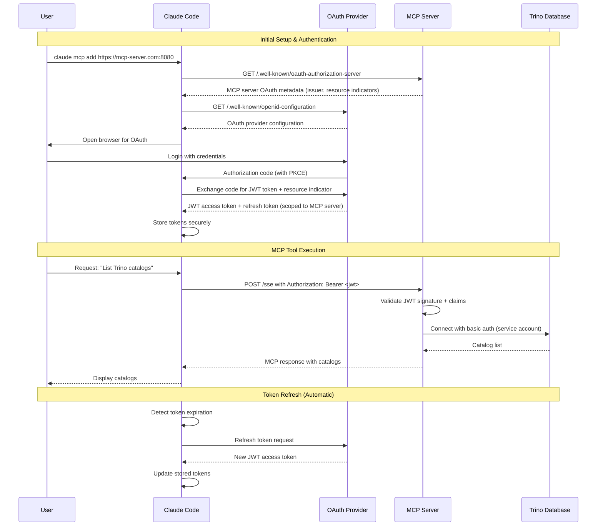
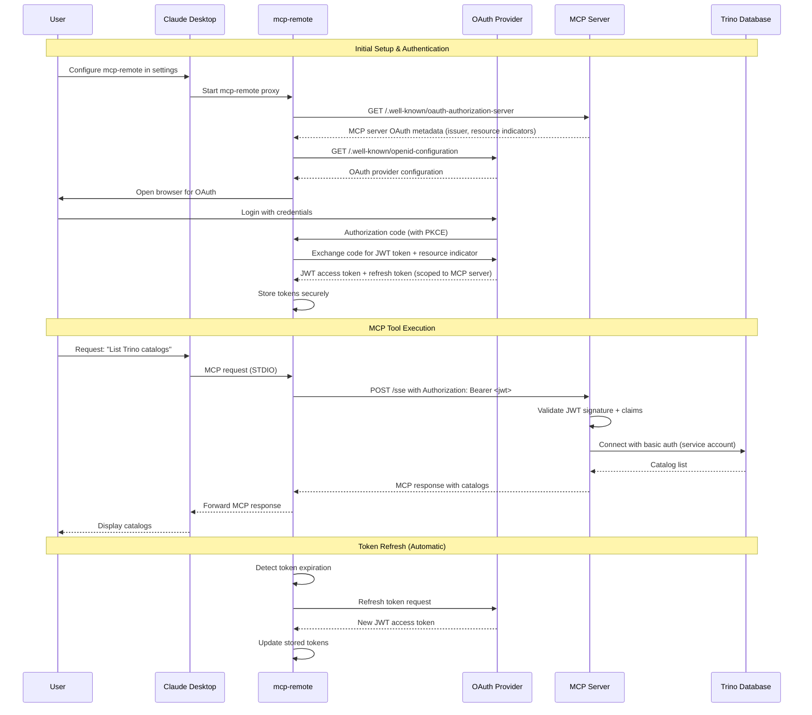
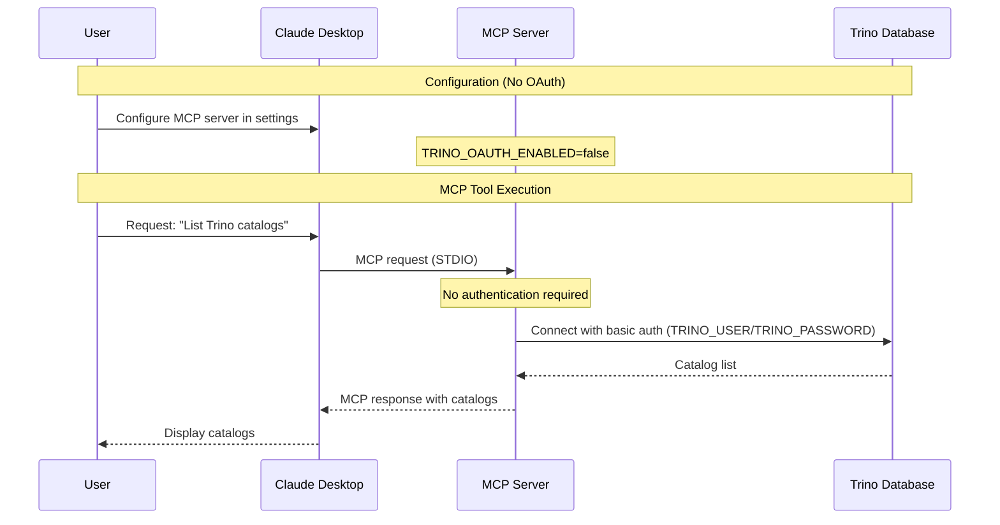
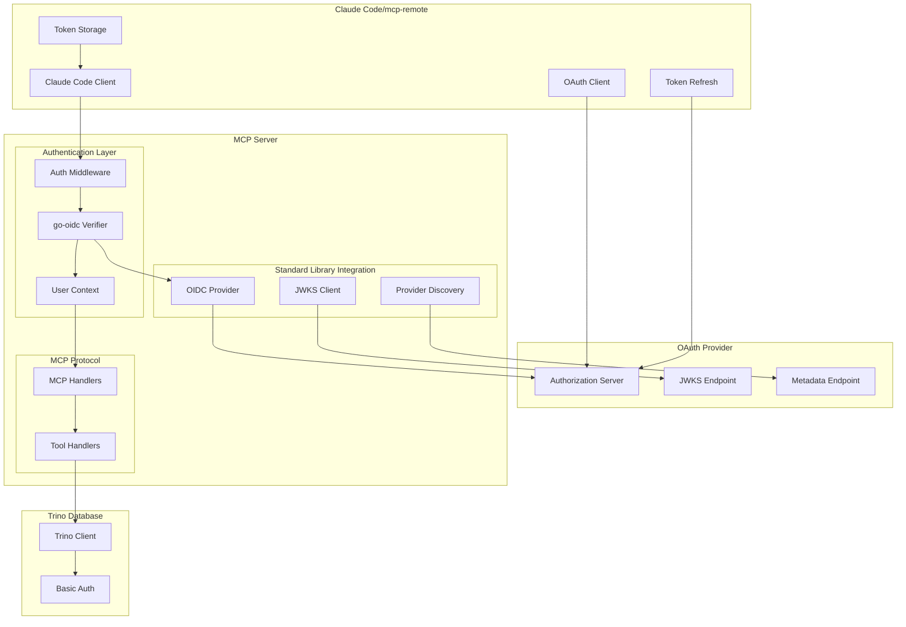

# OAuth Implementation Plan for Trino MCP Server

Based on Claude Code native OAuth support and **Go standard library OAuth implementation**, here's a plan for adding OAuth 2.1 authentication to the Trino MCP server:

## Prerequisites

**IMPORTANT: MCP Server as OAuth Resource Server**

The MCP server acts as an OAuth 2.1 resource server, handling all OAuth-related authorization and token validation. The underlying Trino database does **not** need to support OAuth directly. This includes:

1. **OAuth Provider**: A configured OAuth provider (Google, Azure AD, Okta, etc.) for user authentication
2. **HTTPS Required**: MCP server must be configured with HTTPS (required for OAuth 2.0)
3. **OpenID Connect Discovery**: OAuth provider must support OpenID Connect Discovery for metadata
4. **JWT Token Support**: MCP server validates JWT tokens from Claude Code
5. **Trino Connection**: Trino can use basic authentication, anonymous access, or any existing authentication method

### MCP Server OAuth Configuration Example
```bash
# MCP server environment variables
export TRINO_HOST=trino.example.com
export TRINO_PORT=443
export TRINO_USER=service-account
export TRINO_PASSWORD=service-password
export TRINO_OAUTH_ENABLED=true
export MCP_TRANSPORT=http
export MCP_PORT=8080
export MCP_HTTPS=true
```

### OAuth Provider Configuration
- **Client Registration**: Claude Code/mcp-remote handles client registration (not MCP server)
- **Callback URL**: Configure OAuth provider with Claude Code's callback URL (handled automatically)
- **Scopes**: Typically `openid,profile,email` for user identification
- **Resource Indicators**: Support RFC 8707 for audience specification (required by MCP spec)
- **Authorization Server Metadata**: Support RFC 8414 for metadata discovery (required by MCP spec)

## Architecture Overview

**Claude Code Native Remote MCP Support (Recommended)**
- **Claude Code** connects directly to remote MCP servers with OAuth
- **Claude Code** handles OAuth flow and token management natively
- **MCP Server** acts as OAuth resource server, validating Bearer tokens
- **Trino Database** uses existing authentication (basic auth, anonymous, etc.)

**Benefits of Claude Code Native Support:**
- No proxy needed - direct connection to remote MCP servers
- Native OAuth 2.1 and MCP Authorization specification compliance
- Built-in PKCE support and automatic token refresh
- Simplified setup - just authenticate once
- Remote deployment ready

**Alternative: mcp-remote Proxy Architecture**
- For Claude Desktop or environments where Claude Code native support isn't available
- **Claude Desktop** connects to local `mcp-remote` proxy
- **mcp-remote** handles OAuth flow and token management
- Same benefits as Claude Code native support

## Authentication Flow Options

**Recommended: Claude Code Native Remote MCP with OAuth 2.0**
- **Claude Code** handles browser-based authentication natively
- Built-in PKCE support for security
- Automatic token refresh and storage
- Full MCP Authorization specification compliance
- **Requires**: OAuth provider configured for MCP server authentication

**Alternative: mcp-remote Proxy with OAuth 2.0**
- For Claude Desktop or other MCP clients without native remote support
- **mcp-remote** handles browser-based authentication
- Built-in PKCE support for security
- Automatic token refresh and storage
- **Requires**: OAuth provider configured for MCP server authentication

## Sequence Diagrams

### 1. Claude Code Native OAuth Flow (Recommended)



### 2. mcp-remote Proxy OAuth Flow (Alternative)



### 3. Basic Authentication Flow (Current/Legacy)



### 4. OAuth Authentication Components Architecture



## MCP June 2025 Specification Compliance

### Mandatory Requirements from MCP Specification:
1. **OAuth 2.1 Compliance**: MCP auth implementations MUST implement OAuth 2.1 with appropriate security measures
2. **Resource Indicators (RFC 8707)**: MCP clients MUST implement Resource Indicators to prevent token misuse
3. **Authorization Server Metadata (RFC 8414)**: MCP servers SHOULD and MCP clients MUST implement OAuth 2.0 Authorization Server Metadata
4. **Dynamic Client Registration (RFC 7591)**: MCP auth implementations SHOULD support Dynamic Client Registration Protocol
5. **Bearer Token Authentication**: Access token handling MUST conform to OAuth 2.1 Section 5 requirements
6. **Token Validation**: Resource servers MUST validate access tokens as described in OAuth 2.1 Section 5.2
7. **Error Handling**: If validation fails, servers MUST respond according to OAuth 2.1 Section 5.3
8. **HTTPS Enforcement**: HTTPS enforcement for all authorization endpoints (security requirement)
9. **PKCE**: PKCE support for public clients (OAuth 2.1 requirement)

### Implementation Architecture:
- **Client-Side OAuth**: Claude Code/mcp-remote handles OAuth flows, PKCE, token management, resource indicators
- **Server-Side OAuth**: **Go standard library implementation** for JWT validation and resource server functionality
- **mcp-go Role**: Provides MCP protocol support and client-side OAuth capabilities (not server-side)
- **Current Implementation**: Bearer token validation using `github.com/golang-jwt/jwt/v5`

### Critical Security: Resource Indicators (RFC 8707)
Resource Indicators are MANDATORY for MCP implementations to prevent token misuse:

**How Resource Indicators Work:**
- Claude Code/mcp-remote MUST include `resource` parameter in token requests
- Specifies the exact MCP server URL as the audience (e.g., `https://mcp-server.com:8080`)
- Authorization Server issues tokens scoped only to that specific MCP server
- Prevents malicious servers from using tokens intended for other resources

**Token Request Example:**
```
POST /oauth/token
Content-Type: application/x-www-form-urlencoded

grant_type=authorization_code&
code=abc123&
resource=https://mcp-server.com:8080&
client_id=claude-code
```

**Security Benefits:**
- Token is only valid for the specific MCP server
- Prevents cross-resource token replay attacks
- Enables fine-grained access control per MCP server

### 1. TrinoConfig with OAuth Support (`internal/config/config.go`)
```go
// TrinoConfig holds Trino connection parameters
type TrinoConfig struct {
    // Basic connection parameters
    Host              string
    Port              int
    User              string
    Password          string
    Catalog           string
    Schema            string
    Scheme            string
    SSL               bool
    SSLInsecure       bool
    AllowWriteQueries bool          // Controls whether non-read-only SQL queries are allowed
    QueryTimeout      time.Duration // Query execution timeout
    
    // OAuth mode configuration
    OAuthEnabled      bool   // Enable OAuth 2.1 authentication
}
```

### 2. Bearer Token Validation (`internal/auth/bearer.go`)
- **Current Implementation**: JWT token validation using `github.com/golang-jwt/jwt/v5`
- **RSA Signature Verification**: Uses RSA public key for JWT signature validation
- **Claims Extraction**: Standard JWT claims parsing with issuer and audience validation
- **Error Handling**: Standardized OAuth 2.1 error responses
- **User Context**: Extracts user information from JWT claims
- **Note**: Token acquisition and refresh handled by Claude Code/mcp-remote

### 3. OAuth Provider Configuration (`internal/config/config.go`)
- **OAuth Flag**: Simple boolean flag `OAuthEnabled` to enable/disable OAuth authentication
- **Environment Variables**: Configuration through standard environment variables
- **Basic Integration**: OAuth provider information configured via environment
- **Validation**: Simple validation of OAuth configuration parameters
- **Logging**: OAuth mode status logging for debugging

### 4. HTTP Authentication Middleware (`internal/middleware/auth.go`)
- **Bearer Token Extraction**: Extracts Bearer tokens from Authorization headers
- **Custom JWT Validation**: Token validation using custom bearer token validator
- **User Context Injection**: Add authenticated user context to requests
- **Error Handling**: OAuth 2.1 compliant error responses with specific error types
- **Optional Authentication**: Supports both required and optional authentication modes

### 5. Simplified Trino Client Integration (`internal/trino/client.go`)
- **OAuth Mode**: Use existing basic auth or anonymous connection to Trino (unchanged)
- **Basic Auth Mode**: Use username/password in DSN (unchanged)
- **Authorization**: MCP server handles authorization before requests reach Trino
- No token refresh logic needed (handled by Claude Code/mcp-remote)
- Trino connection method remains independent of OAuth authentication

### 6. OAuth Authorization Server Metadata (Future Implementation)
- **Planned Feature**: OAuth metadata endpoint for MCP server discovery
- **RFC 8414 Compliance**: Will expose OAuth metadata at `/.well-known/oauth-authorization-server`
- **Resource Indicators**: Will advertise support for RFC 8707 resource indicators
- **Provider Integration**: Will proxy provider's metadata with MCP-specific additions
- **Status**: Not yet implemented in current codebase

**Example Metadata Response:**
```json
{
  "issuer": "https://oauth-provider.com",
  "authorization_endpoint": "https://oauth-provider.com/authorize",
  "token_endpoint": "https://oauth-provider.com/token",
  "jwks_uri": "https://oauth-provider.com/.well-known/jwks.json",
  "resource_indicators_supported": true,
  "code_challenge_methods_supported": ["S256"],
  "grant_types_supported": ["authorization_code", "refresh_token"]
}
```

### 7. HTTP Transport Updates (`cmd/main.go`)
- **OAuth Integration**: Custom authentication middleware integration
- **Middleware Stack**: Security headers, CORS, logging, and authentication
- **Configuration-Driven**: OAuth vs basic auth mode selection
- **Error Handling**: Proper HTTP status codes and error responses
- **Remote Access**: HTTP server setup for remote MCP client connections
- **Metadata Endpoint**: Serve OAuth authorization server metadata

## Authentication Configuration Options

### Option 1: OAuth 2.1 with Claude Code Native Support (Recommended)

**Step 1: Deploy MCP Server with OAuth Support**
```bash
# Deploy mcp-trino server with OAuth enabled
export TRINO_HOST=trino.example.com
export TRINO_PORT=443
export TRINO_SCHEME=https
export TRINO_OAUTH_ENABLED=true
export MCP_TRANSPORT=http
export MCP_PORT=8080

./mcp-trino
```

**Step 2: Configure Claude Code with Remote MCP Server**
```bash
# Claude Code will handle OAuth flow automatically
claude mcp add https://your-mcp-server.com:8080
```

**Alternative: Option 2: OAuth 2.1 with mcp-remote (For Claude Desktop)**

**Step 1: Deploy MCP Server (same as above)**

**Step 2: Configure Claude Desktop with mcp-remote**
```json
{
  "mcpServers": {
    "trino": {
      "command": "npx",
      "args": [
        "mcp-remote",
        "https://your-mcp-server.com:8080/sse"
      ]
    }
  }
}
```

### Option 3: Basic Authentication (Current/Legacy - Local Only)
```json
{
  "mcpServers": {
    "trino": {
      "command": "mcp-trino",
      "env": {
        "TRINO_HOST": "trino.example.com",
        "TRINO_PORT": "443",
        "TRINO_USER": "myuser",
        "TRINO_PASSWORD": "mypassword",
        "TRINO_SSL": "true"
      }
    }
  }
}
```

### Detailed OAuth 2.1 Authentication Flow

The sequence diagrams above illustrate the complete OAuth authentication flow. Here's a detailed breakdown:

**Initial Setup & Authentication (see Sequence Diagram 1)**
1. **User Adds Remote MCP Server**: `claude mcp add https://your-server.com:8080`
2. **Claude Code OAuth Discovery**: Claude Code discovers OAuth configuration from MCP server
3. **Browser Authentication**: Claude Code opens browser for OAuth authentication
4. **User Login**: User authenticates with OAuth provider (Google, Azure AD, etc.)
5. **Token Storage**: Claude Code securely stores OAuth tokens locally

**Runtime Operations (see Sequence Diagram 1)**
6. **Authenticated Requests**: Claude Code adds `Authorization: Bearer <token>` to all MCP requests
7. **Token Validation**: MCP server validates JWT signature and claims using JWKS keys
8. **User Context**: MCP server creates user context from JWT claims
9. **Tool Execution**: MCP server executes tools with user context for logging/authorization
10. **Trino Connection**: MCP server connects to Trino using existing authentication (basic auth/anonymous)

**Automatic Token Management (see Sequence Diagram 1)**
11. **Token Refresh**: Claude Code automatically refreshes expired tokens
12. **Seamless Experience**: Users don't need to re-authenticate for subsequent requests

**Key Benefits:**
- **No OAuth complexity in MCP server** - just validate Bearer tokens
- **Native integration** - no proxy needed with Claude Code
- **Automatic token management** - Claude Code handles all OAuth flows
- **MCP Authorization spec compliance** - built into Claude Code
- **Remote deployment ready** - can deploy MCP server anywhere
- **Authenticate once** - seamless experience across sessions

**Alternative Flow with mcp-remote (see Sequence Diagram 2)**
- For Claude Desktop users without native remote MCP support
- `mcp-remote` proxy handles OAuth complexity
- Same security benefits with proxy architecture

## Key Implementation Details

### Simplified Token Management (Claude Code handles complexity)
- **Storage**: Handled by Claude Code locally (secure keychain/credential storage)
- **Refresh Strategy**: Automatic refresh handled by Claude Code
- **Error Handling**: Return authentication errors - no fallback
- **Validation**: MCP server only validates Bearer tokens from HTTP headers

### MCP-Compliant Security Considerations
- **OAuth 2.1**: Full compliance provided by Claude Code
- **Resource Indicators (RFC 8707)**: Implemented by Claude Code
- **PKCE**: Built into Claude Code for security
- **Token Validation**: MCP server validates JWT format, expiration, and basic claims
- **HTTPS Enforcement**: Required for both Claude Code and MCP server
- **Secure Storage**: Claude Code handles secure token storage
- **Error Logging**: Log authentication failures without exposing token data
- **Bearer Token Validation**: Validate tokens are valid JWT format and not expired

### Authentication Method Selection
- **OAuth 2.1**: When `TRINO_OAUTH_ENABLED=true`
- **Basic Auth**: When `TRINO_OAUTH_ENABLED=false` or not set
- **Anonymous**: When no credentials provided (uses default "trino" user)

## Benefits of Claude Code Native OAuth Approach

1. **Dramatically Simplified**: No complex OAuth middleware in MCP server
2. **User-Friendly**: Claude Code handles all OAuth complexity automatically
3. **Native Integration**: No proxy needed - direct connection to remote MCP servers
4. **Secure**: Built-in OAuth 2.1, PKCE, and MCP Authorization spec compliance
5. **Persistent**: Claude Code handles secure token storage and refresh
6. **Trino Compatibility**: Works with any Trino authentication method (basic auth, anonymous, Kerberos, etc.)
7. **Remote Deployment**: Can deploy MCP server anywhere with HTTPS
8. **Cross-Platform**: Works on macOS, Windows, and Linux
9. **MCP Compliant**: Full compliance with June 2025 MCP specification
10. **Separation of Concerns**: OAuth complexity separated from business logic
11. **Easy Testing**: Can test OAuth and MCP server independently
12. **Authenticate Once**: Seamless experience across Claude Code sessions

## Limitations and Requirements

**Prerequisites:**
- OAuth provider (Google, Azure AD, etc.) must be set up and configured for MCP server
- MCP server must be deployed with HTTPS (required for OAuth 2.0)
- OAuth provider must expose OAuth metadata via OpenID Connect Discovery
- Network connectivity to OAuth provider required during authentication
- Browser access required for initial authentication (handled by Claude Code/mcp-remote)
- Trino cluster must be accessible to MCP server (any authentication method supported)

**Important Notes:**
- Claude Code/mcp-remote handles all OAuth flows - no browser integration needed in MCP server
- MCP server must run as HTTP server (not STDIO) for remote access
- Claude Code/mcp-remote creates its own OAuth client registration
- All OAuth complexity is handled by Claude Code/mcp-remote

**Not Suitable For:**
- Environments where Claude Code/mcp-remote cannot be installed
- Scenarios requiring custom authentication flows beyond OAuth 2.1
- Use cases requiring direct MCP server access without OAuth (use basic auth mode instead)

## Implementation Order

1. **Add JWT Dependencies**: Add Go JWT library to go.mod
   ```bash
   go get github.com/golang-jwt/jwt/v5@latest
   go mod tidy
   ```
2. **Create JWT Validator**: Implement JWT Bearer token validation using `github.com/golang-jwt/jwt/v5`
3. **Create OAuth Middleware**: HTTP middleware for Bearer token extraction and validation
4. **Update Configuration**: Add OAuth enable/disable flag to configuration
5. **Add Metadata Endpoint**: Serve OAuth metadata for MCP compliance (planned)
6. **Update Main Application**: Integrate OAuth middleware with HTTP transport
7. **Environment Configuration**: Simple OAuth enable flag configuration
8. **HTTPS Enforcement**: Add HTTPS-only mode for OAuth endpoints
9. **Testing**: Test with Claude Code native OAuth and mcp-remote for compatibility

**Key Implementation Details:**
- **Custom JWT Validation** - Uses `github.com/golang-jwt/jwt/v5` for Bearer token validation
- **Client-Side OAuth Handled by Claude Code/mcp-remote** - No server-side OAuth flows needed
- **JWT Token Validation** - RSA signature validation with issuer and audience checks
- **Bearer Token Middleware** - Custom HTTP middleware for token extraction and validation
- **OAuth Authorization Server Metadata** - Planned feature for MCP compliance
- **No Trino OAuth setup** - MCP server acts as authorization gateway

**Simplified Environment Variables:**
```bash
# Enable OAuth Authentication
TRINO_OAUTH_ENABLED=true

# Trino Connection (unchanged)
TRINO_HOST=trino.example.com
TRINO_PORT=443
TRINO_USER=service-account
TRINO_PASSWORD=service-password

# MCP Server Configuration
MCP_TRANSPORT=http
MCP_PORT=8080
MCP_HTTPS=true
```

This approach provides OAuth 2.1 authentication using **Go standard libraries** for server-side OAuth resource server functionality, while leveraging Claude Code/mcp-remote for client-side OAuth complexity.

## Current Authentication Implementation

The mcp-trino project currently implements **basic username/password authentication** only:

### Configuration (`internal/config/config.go`)
- **Username**: `TRINO_USER` environment variable (default: "trino")
- **Password**: `TRINO_PASSWORD` environment variable (default: "")
- **SSL/TLS**: `TRINO_SSL` (default: true), `TRINO_SSL_INSECURE` (default: true)
- **Scheme**: `TRINO_SCHEME` (default: "https")

### Connection String Construction (`internal/trino/client.go`)
The client builds a DSN (Data Source Name) string with basic auth:
```go
dsn := fmt.Sprintf("%s://%s:%s@%s:%d?catalog=%s&schema=%s&SSL=%t&SSLInsecure=%t",
    cfg.Scheme,
    url.QueryEscape(cfg.User),
    url.QueryEscape(cfg.Password),
    cfg.Host,
    cfg.Port,
    url.QueryEscape(cfg.Catalog),
    url.QueryEscape(cfg.Schema),
    cfg.SSL,
    cfg.SSLInsecure)
```

## Trino Go Client Authentication Capabilities

The `github.com/trinodb/trino-go-client` v0.323.0 supports several authentication methods:

### Supported Methods:
1. **HTTP Basic Authentication** (currently implemented)
2. **Kerberos Authentication** (not implemented)
3. **JWT Authentication** via `AccessToken` field (not implemented)
4. **Authorization Header Forwarding** (not implemented)
5. **Per-Query User Information** (not implemented)

### JWT/OAuth Support:
- **JWT**: Set `AccessToken` field in Config struct
- **OAuth**: Not directly supported - requires OAuth-to-JWT bridge pattern
- **Authorization Header**: Can forward headers per query with `ForwardAuthorizationHeader: true`

## Security Architecture

### Current Security Model:
- **SQL Injection Protection**: `isReadOnlyQuery()` function blocks write operations
- **Query Restrictions**: Only SELECT, SHOW, DESCRIBE, EXPLAIN, WITH queries allowed by default
- **Write Query Override**: `TRINO_ALLOW_WRITE_QUERIES=true` bypasses restrictions (with warning)

### Current Limitations:
- **No Authentication on MCP Layer**: No authentication required for MCP tool calls
- **Basic Auth Only**: No support for modern authentication methods
- **No Authorization**: No user-based access control or permissions
- **No Session Management**: No token refresh or session handling

## Key Integration Points for OAuth Implementation

Based on the current architecture, OAuth/JWT authentication status:

1. **Library Dependencies**: ✅ `github.com/golang-jwt/jwt/v5` added for JWT validation
2. **Config Layer**: ✅ OAuth configuration parameters added (`internal/config/config.go`)
3. **Authentication Layer**: ✅ Custom JWT validation implemented (`internal/auth/bearer.go`)
4. **Middleware Layer**: ✅ Authentication middleware created (`internal/middleware/auth.go`)
5. **Handler Layer**: ✅ Authentication logging and user context handling implemented
6. **Transport Layer**: ⚠️ OAuth middleware integration with HTTP server (needs main.go updates)
7. **Discovery Layer**: ❌ OAuth provider discovery and metadata endpoint (not implemented)

The current codebase has basic OAuth/JWT authentication foundation implemented. The main missing pieces are OAuth metadata endpoint for MCP compliance and full HTTP server integration. Since mcp-go v0.33.0 provides client-side OAuth capabilities but no server-side authentication, we implement the necessary server-side OAuth resource server functionality.