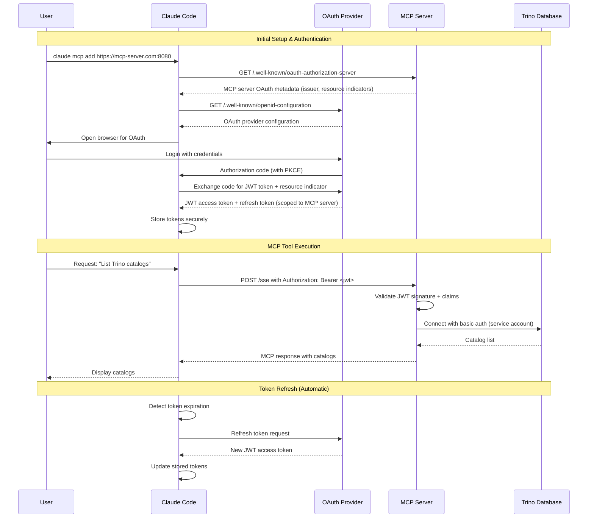
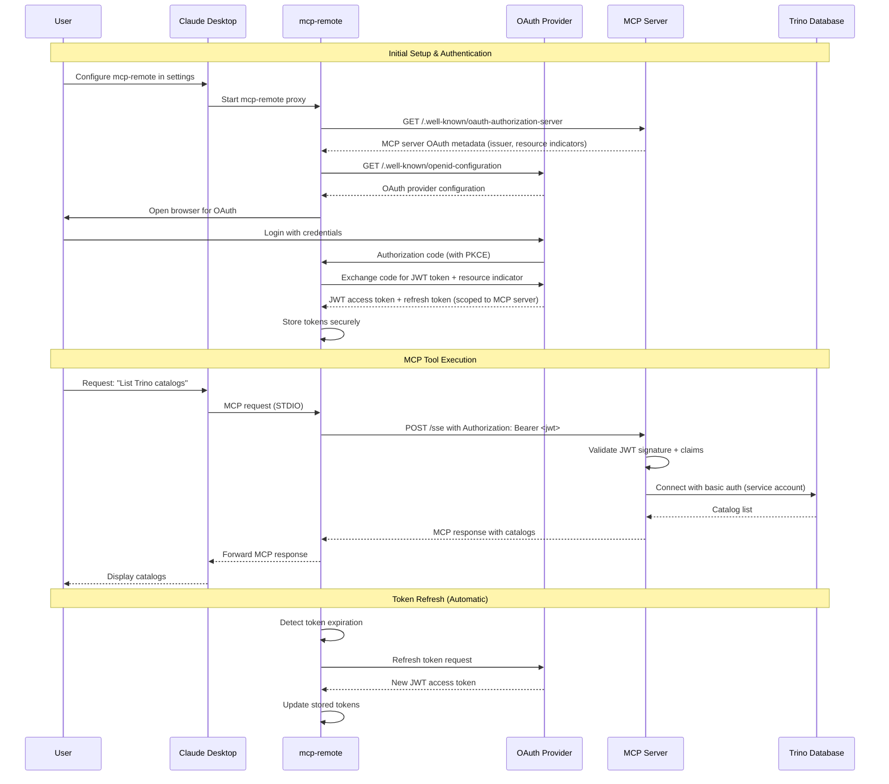
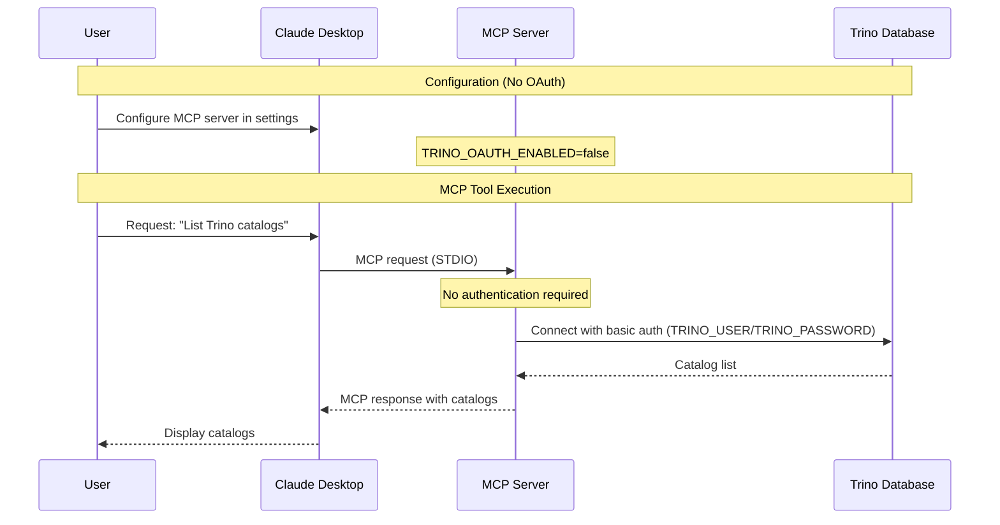
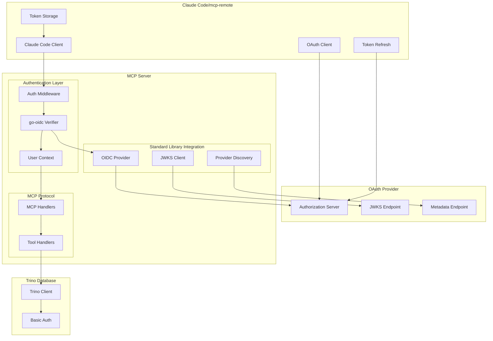

# OAuth Implementation Plan for Trino MCP Server

Based on Claude Code native OAuth support and **Go standard library OAuth implementation**, here's a plan for adding OAuth 2.1 authentication to the Trino MCP server:

## Prerequisites

**IMPORTANT: MCP Server as OAuth Resource Server**

The MCP server acts as an OAuth 2.1 resource server, handling all OAuth-related authorization and token validation. The underlying Trino database does **not** need to support OAuth directly. This includes:

1. **OAuth Provider**: A configured OAuth provider (Google, Azure AD, Okta, etc.) for user authentication
2. **HTTPS Required**: MCP server must be configured with HTTPS (required for OAuth 2.0)
3. **OpenID Connect Discovery**: OAuth provider must support OpenID Connect Discovery for metadata
4. **JWT Token Support**: MCP server validates JWT tokens from Claude Code
5. **Trino Connection**: Trino can use basic authentication, anonymous access, or any existing authentication method

### MCP Server OAuth Configuration Example
```bash
# MCP server environment variables
export TRINO_HOST=trino.example.com
export TRINO_PORT=443
export TRINO_USER=service-account
export TRINO_PASSWORD=service-password
export TRINO_OAUTH_ENABLED=true
export MCP_TRANSPORT=http
export MCP_PORT=8080
export MCP_HTTPS=true
```

### OAuth Provider Configuration
- **Client Registration**: Claude Code/mcp-remote handles client registration (not MCP server)
- **Callback URL**: Configure OAuth provider with Claude Code's callback URL (handled automatically)
- **Scopes**: Typically `openid,profile,email` for user identification
- **Resource Indicators**: Support RFC 8707 for audience specification (required by MCP spec)
- **Authorization Server Metadata**: Support RFC 8414 for metadata discovery (required by MCP spec)

## Architecture Overview

**Claude Code Native Remote MCP Support (Recommended)**
- **Claude Code** connects directly to remote MCP servers with OAuth
- **Claude Code** handles OAuth flow and token management natively
- **MCP Server** acts as OAuth resource server, validating Bearer tokens
- **Trino Database** uses existing authentication (basic auth, anonymous, etc.)

**Benefits of Claude Code Native Support:**
- No proxy needed - direct connection to remote MCP servers
- Native OAuth 2.1 and MCP Authorization specification compliance
- Built-in PKCE support and automatic token refresh
- Simplified setup - just authenticate once
- Remote deployment ready

**Alternative: mcp-remote Proxy Architecture**
- For Claude Desktop or environments where Claude Code native support isn't available
- **Claude Desktop** connects to local `mcp-remote` proxy
- **mcp-remote** handles OAuth flow and token management
- Same benefits as Claude Code native support

## Authentication Flow Options

**Recommended: Claude Code Native Remote MCP with OAuth 2.0**
- **Claude Code** handles browser-based authentication natively
- Built-in PKCE support for security
- Automatic token refresh and storage
- Full MCP Authorization specification compliance
- **Requires**: OAuth provider configured for MCP server authentication

**Alternative: mcp-remote Proxy with OAuth 2.0**
- For Claude Desktop or other MCP clients without native remote support
- **mcp-remote** handles browser-based authentication
- Built-in PKCE support for security
- Automatic token refresh and storage
- **Requires**: OAuth provider configured for MCP server authentication

## Sequence Diagrams

### 1. Claude Code Native OAuth Flow (Recommended)



### 2. mcp-remote Proxy OAuth Flow (Alternative)



### 3. Basic Authentication Flow (Current/Legacy)



### 4. OAuth Authentication Components Architecture



## MCP June 2025 Specification Compliance

### Mandatory Requirements from MCP Specification:
1. **OAuth 2.1 Compliance**: MCP auth implementations MUST implement OAuth 2.1 with appropriate security measures
2. **Resource Indicators (RFC 8707)**: MCP clients MUST implement Resource Indicators to prevent token misuse
3. **Authorization Server Metadata (RFC 8414)**: MCP servers SHOULD and MCP clients MUST implement OAuth 2.0 Authorization Server Metadata
4. **Dynamic Client Registration (RFC 7591)**: MCP auth implementations SHOULD support Dynamic Client Registration Protocol
5. **Bearer Token Authentication**: Access token handling MUST conform to OAuth 2.1 Section 5 requirements
6. **Token Validation**: Resource servers MUST validate access tokens as described in OAuth 2.1 Section 5.2
7. **Error Handling**: If validation fails, servers MUST respond according to OAuth 2.1 Section 5.3
8. **HTTPS Enforcement**: HTTPS enforcement for all authorization endpoints (security requirement)
9. **PKCE**: PKCE support for public clients (OAuth 2.1 requirement)

### Implementation Architecture:
- **Client-Side OAuth**: Claude Code/mcp-remote handles OAuth flows, PKCE, token management, resource indicators
- **Server-Side OAuth**: **Go standard library implementation** for JWT validation and resource server functionality
- **mcp-go Role**: Provides MCP protocol support and client-side OAuth capabilities (not server-side)
- **Current Implementation**: Bearer token validation using `github.com/golang-jwt/jwt/v5`

### Critical Security: Resource Indicators (RFC 8707)
Resource Indicators are MANDATORY for MCP implementations to prevent token misuse:

**How Resource Indicators Work:**
- Claude Code/mcp-remote MUST include `resource` parameter in token requests
- Specifies the exact MCP server URL as the audience (e.g., `https://mcp-server.com:8080`)
- Authorization Server issues tokens scoped only to that specific MCP server
- Prevents malicious servers from using tokens intended for other resources

**Token Request Example:**
```
POST /oauth/token
Content-Type: application/x-www-form-urlencoded

grant_type=authorization_code&
code=abc123&
resource=https://mcp-server.com:8080&
client_id=claude-code
```

**Security Benefits:**
- Token is only valid for the specific MCP server
- Prevents cross-resource token replay attacks
- Enables fine-grained access control per MCP server

### 1. TrinoConfig with OAuth Support (`internal/config/config.go`)
```go
// TrinoConfig holds Trino connection parameters
type TrinoConfig struct {
    // Basic connection parameters
    Host              string
    Port              int
    User              string
    Password          string
    Catalog           string
    Schema            string
    Scheme            string
    SSL               bool
    SSLInsecure       bool
    AllowWriteQueries bool          // Controls whether non-read-only SQL queries are allowed
    QueryTimeout      time.Duration // Query execution timeout
    
    // OAuth mode configuration
    OAuthEnabled      bool   // Enable OAuth 2.1 authentication
}
```

### 2. Bearer Token Validation (`internal/auth/oauth.go`)
- **Current Implementation**: JWT token validation using `github.com/golang-jwt/jwt/v5`
- **Proper JWT Signature Verification**: Uses HMAC-SHA256 with proper signature validation (no ParseUnverified)
- **Claims Extraction**: Standard JWT claims parsing with required subject validation
- **Error Handling**: Standardized OAuth 2.1 error responses
- **User Context**: Extracts user information from JWT claims
- **JWT Secret Caching**: Implements `sync.Once` pattern for efficient secret caching
- **Security Improvements**: No insecure default fallbacks, proper signature verification

### 3. OAuth Provider Configuration (`internal/config/config.go`)
- **OAuth Flag**: Simple boolean flag `OAuthEnabled` to enable/disable OAuth authentication
- **Environment Variables**: Configuration through standard environment variables
- **JWT Secret Management**: JWT_SECRET environment variable required (no default fallback)
- **Basic Integration**: OAuth provider information configured via environment
- **Validation**: Simple validation of OAuth configuration parameters
- **Logging**: OAuth mode status logging for debugging

### 4. HTTP Authentication Implementation (`internal/auth/oauth.go`)
- **Bearer Token Extraction**: Extracts Bearer tokens from Authorization headers
- **Consolidated JWT Validation**: Shared `authenticateRequest()` function eliminates code duplication
- **User Context Injection**: Add authenticated user context to requests
- **Error Handling**: OAuth 2.1 compliant error responses with specific error types
- **Server-Level Authentication**: Uses MCP request hooks for complete API protection
- **Performance Optimizations**: JWT secret caching reduces environment variable lookups

### 5. Simplified Trino Client Integration (`internal/trino/client.go`)
- **OAuth Mode**: Use existing basic auth or anonymous connection to Trino (unchanged)
- **Basic Auth Mode**: Use username/password in DSN (unchanged)
- **Authorization**: MCP server handles authorization before requests reach Trino
- No token refresh logic needed (handled by Claude Code/mcp-remote)
- Trino connection method remains independent of OAuth authentication

### 6. OAuth Authorization Server Metadata (✅ Implemented)
- **Public Endpoint**: OAuth metadata endpoint accessible without authentication
- **RFC 8414 Compliance**: Exposes OAuth metadata at `/.well-known/oauth-authorization-server` and `/.well-known/openid-configuration`
- **Resource Indicators**: Advertises support for RFC 8707 resource indicators
- **Provider Integration**: Proxies provider's metadata with MCP-specific additions
- **Status**: ✅ Implemented in `cmd/main.go` with `handleOAuthMetadata` function

**CRITICAL REQUIREMENT**: The OAuth metadata endpoint MUST be publicly accessible (no authentication required) for MCP clients to discover OAuth configuration. This is handled by processing metadata requests before authentication middleware.

**Example Metadata Response:**
```json
{
  "issuer": "https://oauth-provider.com",
  "authorization_endpoint": "https://oauth-provider.com/authorize",
  "token_endpoint": "https://oauth-provider.com/token",
  "userinfo_endpoint": "https://oauth-provider.com/userinfo",
  "jwks_uri": "https://oauth-provider.com/.well-known/jwks.json",
  "scopes_supported": ["openid", "profile", "email"],
  "response_types_supported": ["code"],
  "grant_types_supported": ["authorization_code", "refresh_token"],
  "subject_types_supported": ["public"],
  "token_endpoint_auth_methods_supported": ["client_secret_post", "client_secret_basic"]
}
```

### 7. HTTP Transport Updates (`cmd/main.go`)
- **OAuth Integration**: Custom authentication middleware integration
- **Middleware Stack**: Security headers, CORS, logging, and authentication
- **Configuration-Driven**: OAuth vs basic auth mode selection
- **Error Handling**: Proper HTTP status codes and error responses
- **Remote Access**: HTTP server setup for remote MCP client connections
- **Public Metadata Endpoint**: Serves OAuth authorization server metadata without authentication
- **Route Handling**: Unauthenticated endpoints (status, metadata) processed before authentication middleware
- **Graceful Shutdown**: Implements graceful HTTP server shutdown with 30-second timeout

## Authentication Configuration Options

### Option 1: OAuth 2.1 with Claude Code Native Support (Recommended)

**Step 1: Deploy MCP Server with OAuth Support**
```bash
# Deploy mcp-trino server with OAuth enabled
export TRINO_HOST=trino.example.com
export TRINO_PORT=443
export TRINO_SCHEME=https
export TRINO_OAUTH_ENABLED=true
export MCP_TRANSPORT=http
export MCP_PORT=8080

./mcp-trino
```

**Step 2: Configure Claude Code with Remote MCP Server**
```bash
# Claude Code handles OAuth flow
claude mcp add https://your-mcp-server.com:8080
```

### Option 2: OAuth 2.1 with mcp-remote (For Claude Desktop)**

**Step 1: Deploy MCP Server (same as above)**

**Step 2: Configure Claude Desktop with mcp-remote**
```json
{
  "mcpServers": {
    "trino": {
      "command": "npx",
      "args": [
        "mcp-remote",
        "https://your-mcp-server.com:8080/sse"
      ]
    }
  }
}
```

### Option 3: Basic Authentication (Current/Legacy - Local Only)
```json
{
  "mcpServers": {
    "trino": {
      "command": "mcp-trino",
      "env": {
        "TRINO_HOST": "trino.example.com",
        "TRINO_PORT": "443",
        "TRINO_USER": "myuser",
        "TRINO_PASSWORD": "mypassword",
        "TRINO_SSL": "true"
      }
    }
  }
}
```

### Detailed OAuth 2.1 Authentication Flow

The sequence diagrams above illustrate the complete OAuth authentication flow. Here's a detailed breakdown:

**Initial Setup & Authentication (see Sequence Diagram 1)**
1. **User Adds Remote MCP Server**: `claude mcp add https://your-server.com:8080`
2. **Claude Code OAuth Discovery**: Claude Code discovers OAuth configuration from MCP server
3. **Browser Authentication**: Claude Code opens browser for OAuth authentication
4. **User Login**: User authenticates with OAuth provider (Google, Azure AD, etc.)
5. **Token Storage**: Claude Code securely stores OAuth tokens locally

**Runtime Operations (see Sequence Diagram 1)**
6. **Authenticated Requests**: Claude Code adds `Authorization: Bearer <token>` to all MCP requests
7. **Token Validation**: MCP server validates JWT signature and claims using JWKS keys
8. **User Context**: MCP server creates user context from JWT claims
9. **Tool Execution**: MCP server executes tools with user context for logging/authorization
10. **Trino Connection**: MCP server connects to Trino using existing authentication (basic auth/anonymous)

**Automatic Token Management (see Sequence Diagram 1)**
11. **Token Refresh**: Claude Code automatically refreshes expired tokens
12. **Seamless Experience**: Users don't need to re-authenticate for subsequent requests

**Key Benefits:**
- **No OAuth complexity in MCP server** - just validate Bearer tokens
- **Native integration** - no proxy needed with Claude Code
- **Automatic token management** - Claude Code handles all OAuth flows
- **MCP Authorization spec compliance** - built into Claude Code
- **Remote deployment ready** - can deploy MCP server anywhere
- **Authenticate once** - seamless experience across sessions

**Alternative Flow with mcp-remote (see Sequence Diagram 2)**
- For Claude Desktop users without native remote MCP support
- `mcp-remote` proxy handles OAuth complexity
- Same security benefits with proxy architecture

## Key Implementation Details

### Simplified Token Management (Claude Code handles complexity)
- **Storage**: Handled by Claude Code locally (secure keychain/credential storage)
- **Refresh Strategy**: Automatic refresh handled by Claude Code
- **Error Handling**: Return authentication errors - no fallback
- **Validation**: MCP server only validates Bearer tokens from HTTP headers

### MCP-Compliant Security Considerations
- **OAuth 2.1**: Full compliance provided by Claude Code
- **Resource Indicators (RFC 8707)**: Implemented by Claude Code
- **PKCE**: Built into Claude Code for security
- **Token Validation**: MCP server validates JWT format, expiration, and basic claims
- **HTTPS Enforcement**: Required for both Claude Code and MCP server
- **Secure Storage**: Claude Code handles secure token storage
- **Error Logging**: Log authentication failures without exposing token data
- **Bearer Token Validation**: Validate tokens are valid JWT format and not expired

### Authentication Method Selection
- **OAuth 2.1**: When `TRINO_OAUTH_ENABLED=true`
- **Basic Auth**: When `TRINO_OAUTH_ENABLED=false` or not set
- **Anonymous**: When no credentials provided (uses default "trino" user)

## Benefits of Claude Code Native OAuth Approach

1. **Dramatically Simplified**: No complex OAuth middleware in MCP server
2. **User-Friendly**: Claude Code handles all OAuth complexity automatically
3. **Native Integration**: No proxy needed - direct connection to remote MCP servers
4. **Secure**: Built-in OAuth 2.1, PKCE, and MCP Authorization spec compliance
5. **Persistent**: Claude Code handles secure token storage and refresh
6. **Trino Compatibility**: Works with any Trino authentication method (basic auth, anonymous, Kerberos, etc.)
7. **Remote Deployment**: Can deploy MCP server anywhere with HTTPS
8. **Cross-Platform**: Works on macOS, Windows, and Linux
9. **MCP Compliant**: Full compliance with June 2025 MCP specification
10. **Separation of Concerns**: OAuth complexity separated from business logic
11. **Easy Testing**: Can test OAuth and MCP server independently
12. **Authenticate Once**: Seamless experience across Claude Code sessions

## Limitations and Requirements

**Prerequisites:**
- OAuth provider (Google, Azure AD, etc.) must be set up and configured for MCP server
- MCP server must be deployed with HTTPS (required for OAuth 2.0)
- OAuth provider must expose OAuth metadata via OpenID Connect Discovery
- Network connectivity to OAuth provider required during authentication
- Browser access required for initial authentication (handled by Claude Code/mcp-remote)
- Trino cluster must be accessible to MCP server (any authentication method supported)

**Important Notes:**
- Claude Code/mcp-remote handles all OAuth flows - no browser integration needed in MCP server
- MCP server must run as HTTP server (not STDIO) for remote access
- Claude Code/mcp-remote creates its own OAuth client registration
- All OAuth complexity is handled by Claude Code/mcp-remote

**Not Suitable For:**
- Environments where Claude Code/mcp-remote cannot be installed
- Scenarios requiring custom authentication flows beyond OAuth 2.1
- Use cases requiring direct MCP server access without OAuth (use basic auth mode instead)

## Next Steps: Okta Integration Strategy

### Current Implementation Status

The mcp-trino server currently has a **complete OAuth implementation using fixed JWT secrets** (HMAC-SHA256). To support real OAuth providers like Okta, we need to implement **OAuth Provider Abstraction** with OIDC discovery and JWKS validation.

**Important**: The implementation must support **three OAuth modes** simultaneously:

1. **Fixed JWT (HMAC-SHA256)**: 
   - Current implementation for backward compatibility
   - Ideal for service-to-service authentication
   - Development/testing environments
   - Internal systems that don't require full OAuth providers

2. **Claude Code Flow**: Native OAuth client with automatic token refresh
3. **mcp-remote Flow**: Token passed via HTTP headers from Claude Desktop

All three modes converge on the same server-side token validation logic through the provider abstraction layer.

### Implementation Roadmap for Okta Integration

#### Phase 1: OAuth Provider Abstraction (Next Priority)

1. **Add Required Dependencies**:
   ```bash
   # OIDC library (CoreOS maintained)
   go get github.com/coreos/go-oidc/v3/oidc@latest
   
   # Go OAuth2 library (golang.org extended packages)
   go get golang.org/x/oauth2@latest
   
   # JWT library for HMAC validation
   go get github.com/golang-jwt/jwt/v5@latest
   
   go mod tidy
   ```

2. **Create Provider Interface** (`internal/auth/provider.go`):
   ```go
   type TokenValidator interface {
       ValidateToken(token string) (*User, error)
       Initialize(cfg *config.TrinoConfig) error
   }

   type HMACValidator struct {        // Current implementation - PRESERVED for backward compatibility
       secret string
   }

   type OIDCValidator struct {        // New for Okta/Google/Azure
       verifier *oidc.IDTokenVerifier
       provider *oidc.Provider
   }
   ```

3. **Update MCP Server Middleware** (`internal/auth/oauth.go`):
   ```go
   import (
       "context"
       "fmt"
       "log"
       
       "github.com/mark3labs/mcp-go/mcp"
       "github.com/mark3labs/mcp-go/server"
   )

   // OAuthMiddleware creates an authentication middleware for MCP tools
   // This integrates with mcp-go server middleware system
   func OAuthMiddleware(validator TokenValidator, enabled bool) func(server.ToolHandlerFunc) server.ToolHandlerFunc {
       return func(next server.ToolHandlerFunc) server.ToolHandlerFunc {
           return func(ctx context.Context, req mcp.CallToolRequest) (*mcp.CallToolResult, error) {
               if !enabled {
                   log.Printf("OAuth: Authentication disabled - allowing tool: %s", req.Params.Name)
                   return next(ctx, req)
               }

               // Extract token from context (set by HTTP middleware)
               token, ok := GetOAuthToken(ctx)
               if !ok {
                   return nil, fmt.Errorf("authentication required: missing OAuth token")
               }

               // Validate token using configured provider
               user, err := validator.ValidateToken(token)
               if err != nil {
                   log.Printf("OAuth: Token validation failed for tool %s: %v", req.Params.Name, err)
                   return nil, fmt.Errorf("authentication failed: %w", err)
               }

               // Add user to context for downstream handlers
               ctx = context.WithValue(ctx, userContextKey, user)
               log.Printf("OAuth: Authenticated user %s for tool: %s", user.Username, req.Params.Name)
               
               return next(ctx, req)
           }
       }
   }
   ```

4. **Enhanced Configuration** (`internal/config/config.go`):
   ```go
   // Update existing TrinoConfig to support OAuth providers
   type TrinoConfig struct {
       // ... existing fields ...
       
       // OAuth configuration
       OAuthEnabled      bool   // Enable OAuth 2.1 authentication
       OAuthProvider     string // OAuth provider: "hmac", "okta", "google", "azure"
       JWTSecret         string // JWT signing secret for HMAC provider
       
       // OIDC provider configuration
       OIDCIssuer        string // OIDC issuer URL
       OIDCAudience      string // OIDC audience
       OIDCClientID      string // OIDC client ID
       OIDCClientSecret  string // OIDC client secret
       
       // HTTP transport configuration
       Transport         string // "stdio" or "http"
       HTTPPort          int    // HTTP port for mcp-remote
   }
   
   // Update NewTrinoConfig to load OAuth provider configuration
   func NewTrinoConfig() *TrinoConfig {
       // ... existing configuration loading ...
       
       // OAuth configuration
       oauthEnabled, _ := strconv.ParseBool(getEnv("TRINO_OAUTH_ENABLED", "false"))
       oauthProvider := strings.ToLower(getEnv("OAUTH_PROVIDER", "hmac"))
       jwtSecret := getEnv("JWT_SECRET", "")
       
       // OIDC configuration
       oidcIssuer := getEnv("OIDC_ISSUER", "")
       oidcAudience := getEnv("OIDC_AUDIENCE", "")
       oidcClientID := getEnv("OIDC_CLIENT_ID", "")
       oidcClientSecret := getEnv("OIDC_CLIENT_SECRET", "")
       
       // Transport configuration
       transport := getEnv("MCP_TRANSPORT", "stdio")
       httpPort, _ := strconv.Atoi(getEnv("MCP_PORT", "8080"))
       
       return &TrinoConfig{
           // ... existing fields ...
           OAuthEnabled:     oauthEnabled,
           OAuthProvider:    oauthProvider,
           JWTSecret:        jwtSecret,
           OIDCIssuer:       oidcIssuer,
           OIDCAudience:     oidcAudience,
           OIDCClientID:     oidcClientID,
           OIDCClientSecret: oidcClientSecret,
           Transport:        transport,
           HTTPPort:         httpPort,
       }
   }
   ```

5. **Environment Variables**:
   ```bash
   # OAuth Provider Selection
   OAUTH_PROVIDER=okta                    # "hmac", "okta", "google", "azure"

   # HMAC Provider (backward compatibility & service-to-service)
   JWT_SECRET=your-secret-key

   # OIDC Provider Configuration (works for all OIDC providers)
   OIDC_ISSUER=https://your-domain.okta.com
   OIDC_AUDIENCE=api://mcp-trino
   OIDC_CLIENT_ID=your-client-id
   OIDC_CLIENT_SECRET=your-client-secret

   # Transport Configuration
   MCP_TRANSPORT=http                     # "stdio" or "http"
   MCP_PORT=8080                          # HTTP port for mcp-remote
   ```

#### Phase 2: MCP Server Integration

6. **OAuth Server Setup** (`internal/auth/server.go`):
   ```go
   import (
       "context"
       "fmt"
       "log"
       
       "github.com/mark3labs/mcp-go/server"
       
       "your-module/internal/config"
       "your-module/internal/handlers"
   )

   // SetupOAuthServer initializes OAuth validation and sets up MCP server with middleware
   func SetupOAuthServer(cfg *config.TrinoConfig, s *server.MCPServer) error {
       if !cfg.OAuthEnabled {
           log.Println("OAuth authentication disabled")
           return nil
       }
       
       // Initialize OAuth provider based on configuration
       validator, err := createValidator(cfg)
       if err != nil {
           return fmt.Errorf("failed to create OAuth validator: %w", err)
       }
       
       if err := validator.Initialize(cfg); err != nil {
           return fmt.Errorf("failed to initialize OAuth validator: %w", err)
       }
       
       // Apply OAuth middleware to all tool handlers
       applyOAuthMiddleware(s, validator, cfg.OAuthEnabled)
       
       // Set up HTTP context function for token extraction
       if cfg.Transport == "http" {
           s.SetHTTPContextFunc(CreateHTTPContextFunc())
       }
       
       log.Printf("OAuth authentication enabled with provider: %s", cfg.OAuthProvider)
       return nil
   }

   // createValidator creates the appropriate token validator based on configuration
   func createValidator(cfg *config.TrinoConfig) (TokenValidator, error) {
       switch cfg.OAuthProvider {
       case "hmac":
           return &HMACValidator{}, nil
       case "okta", "google", "azure":
           return &OIDCValidator{}, nil
       default:
           return &HMACValidator{}, nil // Default to HMAC
       }
   }

   // applyOAuthMiddleware applies OAuth middleware to all tool handlers
   func applyOAuthMiddleware(s *server.MCPServer, validator TokenValidator, enabled bool) {
       middleware := OAuthMiddleware(validator, enabled)
       
       // Apply middleware to each tool handler
       s.SetToolHandler("execute_query", middleware(handlers.ExecuteQueryHandler))
       s.SetToolHandler("list_catalogs", middleware(handlers.ListCatalogsHandler))
       s.SetToolHandler("list_schemas", middleware(handlers.ListSchemasHandler))
       s.SetToolHandler("list_tables", middleware(handlers.ListTablesHandler))
       s.SetToolHandler("get_table_schema", middleware(handlers.GetTableSchemaHandler))
   }
   ```

7. **Simplified Main Function** (`cmd/main.go`):
   ```go
   import (
       "context"
       "log"
       
       "github.com/mark3labs/mcp-go/server"
       
       "your-module/internal/auth"
       "your-module/internal/config"
   )

   func main() {
       // Initialize configuration
       cfg := config.NewTrinoConfig()
       
       // Create MCP server
       s := server.NewMCPServer("trino", "1.0.0")
       
       // Setup OAuth (if enabled)
       if err := auth.SetupOAuthServer(cfg, s); err != nil {
           log.Fatalf("Failed to setup OAuth: %v", err)
       }
       
       // Start server
       if err := s.Serve(context.Background()); err != nil {
           log.Fatalf("Server failed: %v", err)
       }
   }
   ```

#### Phase 3: Okta OIDC Implementation

8. **OIDC Discovery and JWKS Validation** (`internal/auth/oidc.go`):
   ```go
   import (
       "context"
       "crypto/tls"
       "fmt"
       "net/http"
       "time"
       
       "github.com/coreos/go-oidc/v3/oidc"
   )

   func (v *OIDCValidator) Initialize(cfg *config.TrinoConfig) error {
       // Use standard library context with timeout
       ctx, cancel := context.WithTimeout(context.Background(), 30*time.Second)
       defer cancel()
       
       // Configure HTTP client with appropriate timeouts and TLS settings
       httpClient := &http.Client{
           Timeout: 30 * time.Second,
           Transport: &http.Transport{
               TLSClientConfig: &tls.Config{
                   InsecureSkipVerify: false, // Verify TLS certificates
                   MinVersion:         tls.VersionTLS12,
               },
               IdleConnTimeout:     90 * time.Second,
               TLSHandshakeTimeout: 10 * time.Second,
               MaxIdleConns:        100,
               MaxIdleConnsPerHost: 10,
           },
       }
       
       // Create OIDC provider with custom HTTP client
       provider, err := oidc.NewProvider(
           oidc.ClientContext(ctx, httpClient), 
           cfg.OIDCIssuer,
       )
       if err != nil {
           return fmt.Errorf("failed to initialize OIDC provider: %w", err)
       }
       
       // Configure token verifier with required validation settings
       verifier := provider.Verifier(&oidc.Config{
           ClientID:             cfg.OIDCAudience,
           SupportedSigningAlgs: []string{oidc.RS256, oidc.ES256},
           SkipClientIDCheck:    false, // Verify audience
           SkipExpiryCheck:      false, // Verify expiration
           SkipIssuerCheck:      false, // Verify issuer
       })
       
       v.provider = provider
       v.verifier = verifier
       return nil
   }
   
   func (v *OIDCValidator) ValidateToken(tokenString string) (*User, error) {
       // Use standard library context with timeout
       ctx, cancel := context.WithTimeout(context.Background(), 10*time.Second)
       defer cancel()
       
       // go-oidc handles RSA signature validation, JWKS fetching, and key rotation
       idToken, err := v.verifier.Verify(ctx, tokenString)
       if err != nil {
           return nil, fmt.Errorf("token verification failed: %w", err)
       }
       
       // Extract claims from verified token
       var claims struct {
           Subject           string `json:"sub"`
           PreferredUsername string `json:"preferred_username"`
           Email             string `json:"email"`
           EmailVerified     bool   `json:"email_verified,omitempty"`
           Name              string `json:"name,omitempty"`
           // Standard OIDC claims are validated by go-oidc:
           // - iss (issuer)
           // - aud (audience) 
           // - exp (expiration)
           // - iat (issued at)
           // - nbf (not before)
       }
       
       if err := idToken.Claims(&claims); err != nil {
           return nil, fmt.Errorf("failed to extract claims: %w", err)
       }
       
       return &User{
           Subject:  claims.Subject,
           Username: claims.PreferredUsername,
           Email:    claims.Email,
       }, nil
   }
   ```

9. **Implementation Benefits**:
   - **JWKS Key Fetching**: `go-oidc` uses standard `net/http` for key retrieval
   - **Signature Validation**: Uses standard `crypto/rsa`, `crypto/ecdsa`, and `crypto/x509` packages
   - **TLS Certificate Validation**: Standard `crypto/tls` with configurable minimum version
   - **HTTP Client Configuration**: Standard `net/http.Client` with connection pooling
   - **Context-Based Timeouts**: Standard `context` package for request cancellation
   - **Key Rotation**: `go-oidc` handles JWKS caching and refresh
   - **Claims Validation**: RFC 7519 JWT claims validation
   - **Algorithm Support**: Common signing algorithms (RS256, RS384, RS512, ES256, ES384, ES512)

#### Phase 4: Enhanced Metadata Endpoint

10. **OAuth Metadata Endpoint** (`internal/auth/metadata.go`):
   ```go
   import (
       "context"
       "encoding/json"
       "fmt"
       "net/http"
       "time"
   )

   func handleOAuthMetadata(w http.ResponseWriter, r *http.Request, cfg *config.TrinoConfig) {
       // Use standard library context with timeout
       ctx, cancel := context.WithTimeout(r.Context(), 10*time.Second)
       defer cancel()
       
       // Standard HTTP headers using net/http
       w.Header().Set("Content-Type", "application/json")
       w.Header().Set("Cache-Control", "public, max-age=3600") // Cache for 1 hour
       
       switch cfg.OAuthProvider {
       case "okta", "google", "azure":
           // Proxy OAuth provider's metadata using standard library
           metadata, err := fetchProviderMetadata(ctx, cfg.OIDCIssuer)
           if err != nil {
               http.Error(w, "Failed to fetch provider metadata", http.StatusInternalServerError)
               return
           }
           
           // Add MCP-specific extensions for both Claude Code and mcp-remote
           metadata["resource_indicators_supported"] = true
           metadata["mcp_server_version"] = "1.0"
           
           // Claude Code native OAuth flow support
           metadata["claude_code_flow_supported"] = true
           
           // mcp-remote flow support (token via HTTP headers)
           metadata["mcp_remote_flow_supported"] = true
           metadata["token_auth_methods_supported"] = []string{"Bearer"}
           
           // Use standard library JSON encoder
           if err := json.NewEncoder(w).Encode(metadata); err != nil {
               http.Error(w, "Failed to encode response", http.StatusInternalServerError)
               return
           }
           
       case "hmac":
           // HMAC metadata for backward compatibility and service-to-service
           metadata := map[string]interface{}{
               "issuer":                    "mcp-trino-server",
               "token_endpoint_auth_methods_supported": []string{"none"},
               "response_types_supported":  []string{"code"},
               "subject_types_supported":   []string{"public"},
               "id_token_signing_alg_values_supported": []string{"HS256"},
               "resource_indicators_supported": true,
               "mcp_server_version":        "1.0",
               
               // Dual flow support + service-to-service
               "claude_code_flow_supported": true,
               "mcp_remote_flow_supported": true,
               "service_to_service_supported": true,
               "token_auth_methods_supported": []string{"Bearer"},
               "use_case": "backward_compatibility_and_service_to_service",
           }
           
           if err := json.NewEncoder(w).Encode(metadata); err != nil {
               http.Error(w, "Failed to encode response", http.StatusInternalServerError)
               return
           }
       }
   }
   
   func fetchProviderMetadata(ctx context.Context, issuer string) (map[string]interface{}, error) {
       // Use standard library HTTP client with context
       client := &http.Client{
           Timeout: 10 * time.Second,
       }
       
       req, err := http.NewRequestWithContext(ctx, "GET", 
           issuer+"/.well-known/openid-configuration", nil)
       if err != nil {
           return nil, fmt.Errorf("failed to create request: %w", err)
       }
       
       resp, err := client.Do(req)
       if err != nil {
           return nil, fmt.Errorf("failed to fetch metadata: %w", err)
       }
       defer resp.Body.Close()
       
       if resp.StatusCode != http.StatusOK {
           return nil, fmt.Errorf("unexpected status: %d", resp.StatusCode)
       }
       
       var metadata map[string]interface{}
       if err := json.NewDecoder(resp.Body).Decode(&metadata); err != nil {
           return nil, fmt.Errorf("failed to decode metadata: %w", err)
       }
       
       return metadata, nil
   }
   ```

#### Phase 5: Testing and Validation

11. **Testing Strategy**:
   ```go
   import (
       "context"
       "net/http"
       "net/http/httptest"
       "testing"
       "time"
   )
   
   func TestOIDCValidator(t *testing.T) {
       // Mock OIDC endpoints using httptest
       server := httptest.NewTLSServer(http.HandlerFunc(func(w http.ResponseWriter, r *http.Request) {
           // Mock OIDC discovery endpoint
           if r.URL.Path == "/.well-known/openid-configuration" {
               w.Header().Set("Content-Type", "application/json")
               w.Header().Set("Cache-Control", "public, max-age=3600")
               mockConfig := map[string]interface{}{
                   "issuer":                 server.URL,
                   "jwks_uri":              server.URL + "/.well-known/jwks.json",
                   "id_token_signing_alg_values_supported": []string{"RS256", "ES256"},
               }
               json.NewEncoder(w).Encode(mockConfig)
           }
           // Mock JWKS endpoint
           if r.URL.Path == "/.well-known/jwks.json" {
               w.Header().Set("Content-Type", "application/json")
               w.Header().Set("Cache-Control", "public, max-age=3600")
               // Return mock JWKS with test keys
           }
       }))
       defer server.Close()
       
       // Test with context timeout
       ctx, cancel := context.WithTimeout(context.Background(), 5*time.Second)
       defer cancel()
       
       validator := &OIDCValidator{}
       cfg := &config.TrinoConfig{
           OAuthProvider: "okta",
           OIDCIssuer:   server.URL,
           OIDCAudience: "test-audience",
       }
       
       // Test initialization
       err := validator.Initialize(cfg)
       if err != nil {
           t.Fatalf("Failed to initialize validator: %v", err)
       }
       
       // Verify initialization
       if validator.provider == nil {
           t.Fatal("Provider should be initialized")
       }
       if validator.verifier == nil {
           t.Fatal("Verifier should be initialized")
       }
   }
   ```
   
   **Testing Approach**:
   - **Unit Tests**: Each provider type using standard `testing` package
   - **HTTP Mocking**: `net/http/httptest` for OIDC endpoints
   - **Context Testing**: Timeout and cancellation patterns
   - **Integration Tests**: Real OAuth provider testing
   - **Backward Compatibility**: Existing `JWT_SECRET` validation
   - **Performance Tests**: Benchmarks for JWKS caching behavior
   - **Race Detection**: `go test -race` for concurrency issues

### Implementation Characteristics

1. **MCP-go Middleware Integration**: Proper use of mcp-go server middleware system
2. **Clean Architecture**: OAuth logic separated into internal packages, minimal main function
3. **Backward Compatibility**: Existing `JWT_SECRET` configurations remain functional
4. **OIDC Support**: Implements standard OIDC/JWKS validation 
5. **Multi-Provider Support**: Configurable for different OAuth providers (Okta, Google, Azure AD)
6. **No Hardcoded Secrets**: Uses environment variables for configuration
7. **MCP Compliance**: Implements OAuth 2.1 and MCP Authorization specification
8. **Standard Library Usage**: Utilizes Go's built-in packages where possible
9. **Established Libraries**: Uses well-maintained libraries (`go-oidc`, `golang.org/x/oauth2`)
10. **Context Support**: Standard `context` patterns for timeout and cancellation
11. **HTTP Configuration**: Standard `net/http` client with timeouts
12. **Multiple Client Support**: Single server implementation supports Claude Code and mcp-remote
13. **Unified Validation**: Same token validation logic across client types
14. **Per-Tool Authentication**: Each MCP tool handler can have authentication via middleware

### Standard Library Integration

**Crypto Operations**:
- **RSA Validation**: `go-oidc` uses standard `crypto/rsa`
- **X.509 Certificates**: Standard `crypto/x509` for certificate validation  
- **TLS Security**: Standard `crypto/tls` for secure connections
- **JWT Claims**: Standard `encoding/json` for claims parsing

**HTTP Operations**:
- **HTTP Client**: Standard `net/http.Client` with timeouts
- **Request Context**: Standard `context` for cancellation and deadlines
- **JSON Handling**: Standard `encoding/json` for JSON operations
- **Error Responses**: Standard `http.Error` patterns

**Concurrency and Performance**:
- **Context Cancellation**: Standard timeout handling patterns
- **HTTP Connection Pooling**: Built-in `http.Transport` features
- **JWKS Caching**: `go-oidc` handles caching
- **TLS Configuration**: Standard `crypto/tls` connection reuse

### Environment Configuration Examples

**Development/Testing and Service-to-Service (current approach):**
```bash
OAUTH_PROVIDER=hmac
JWT_SECRET=development-secret-key
TRINO_OAUTH_ENABLED=true
```

**Production with Okta:**
```bash
OAUTH_PROVIDER=okta
OIDC_ISSUER=https://your-company.okta.com
OIDC_AUDIENCE=api://mcp-trino-prod
OIDC_CLIENT_ID=0oa1a2b3c4d5e6f7g8h9
TRINO_OAUTH_ENABLED=true
MCP_TRANSPORT=http
```

**Production with Google:**
```bash
OAUTH_PROVIDER=google
OIDC_ISSUER=https://accounts.google.com
OIDC_AUDIENCE=123456789-abc.apps.googleusercontent.com
OIDC_CLIENT_ID=123456789-abc.apps.googleusercontent.com
TRINO_OAUTH_ENABLED=true
MCP_TRANSPORT=http
```

## Summary: Triple Mode Implementation Strategy

This implementation strategy extends the current fixed JWT implementation to support OAuth providers while maintaining backward compatibility and supporting multiple client types.

### Implementation Approach

**1. Crypto Operations**:
- Uses `go-oidc` library for RSA/JWKS operations via standard `crypto/rsa`
- Standard `crypto/x509` for certificate validation
- Standard `crypto/tls` for secure connections
- Preserves existing JWT validation for HMAC-SHA256 tokens

**2. HTTP Operations**:
- Standard `net/http.Client` with timeout configurations
- Standard `context` package for request cancellation and deadlines
- Standard `encoding/json` for JSON encoding/decoding
- Standard `net/http/httptest` for testing

**3. OAuth Libraries**:
- `github.com/coreos/go-oidc/v3/oidc` - OIDC library (CoreOS maintained)
- `golang.org/x/oauth2` - Go OAuth2 implementation (golang.org extended packages)
- `github.com/golang-jwt/jwt/v5` - JWT library for Go

**4. Configuration Management**:
- Standard `os` package for environment variables
- Standard `strconv` and `strings` for type conversion
- Standard `time.Duration` for timeout configuration
- Standard error handling with `fmt.Errorf` and error wrapping

**5. Architecture Characteristics**:
- **MCP-go Middleware Integration**: Uses mcp-go server middleware system for per-tool authentication
- **Single Token Validation Logic**: Same server-side validation for all three modes
- **Unified OAuth Metadata**: One endpoint serves all client types
- **Multiple Client Support**: Works with Claude Code, mcp-remote, and service-to-service
- **Backward Compatibility**: Existing JWT_SECRET implementations continue to work
- **HMAC-SHA256 Support**: Maintained for service-to-service authentication

**6. Standard Library Usage**:
- Uses `go-oidc` for JWKS client functionality
- Uses `go-oidc` for RSA validation via standard library
- Uses standard `net/http` patterns for HTTP clients
- Uses standard `encoding/json` for JSON handling
- Uses standard `context` patterns for timeouts
- Uses standard `crypto/tls` for TLS configuration

This approach provides a migration path from the current JWT implementation to OAuth provider support while maintaining compatibility with existing deployments and supporting multiple authentication flows through a unified server implementation.

## Current Authentication Implementation

The mcp-trino project currently implements **basic username/password authentication** only:

### Configuration (`internal/config/config.go`)
- **Username**: `TRINO_USER` environment variable (default: "trino")
- **Password**: `TRINO_PASSWORD` environment variable (default: "")
- **SSL/TLS**: `TRINO_SSL` (default: true), `TRINO_SSL_INSECURE` (default: true)
- **Scheme**: `TRINO_SCHEME` (default: "https")

### Connection String Construction (`internal/trino/client.go`)
The client builds a DSN (Data Source Name) string with basic auth:
```go
dsn := fmt.Sprintf("%s://%s:%s@%s:%d?catalog=%s&schema=%s&SSL=%t&SSLInsecure=%t",
    cfg.Scheme,
    url.QueryEscape(cfg.User),
    url.QueryEscape(cfg.Password),
    cfg.Host,
    cfg.Port,
    url.QueryEscape(cfg.Catalog),
    url.QueryEscape(cfg.Schema),
    cfg.SSL,
    cfg.SSLInsecure)
```

## Trino Go Client Authentication Capabilities

The `github.com/trinodb/trino-go-client` v0.323.0 supports several authentication methods:

### Supported Methods:
1. **HTTP Basic Authentication** (currently implemented)
2. **Kerberos Authentication** (not implemented)
3. **JWT Authentication** via `AccessToken` field (not implemented)
4. **Authorization Header Forwarding** (not implemented)
5. **Per-Query User Information** (not implemented)

### JWT/OAuth Support:
- **JWT**: Set `AccessToken` field in Config struct
- **OAuth**: Not directly supported - requires OAuth-to-JWT bridge pattern
- **Authorization Header**: Can forward headers per query with `ForwardAuthorizationHeader: true`

## Security Architecture

### Current Security Model:
- **SQL Injection Protection**: `isReadOnlyQuery()` function blocks write operations
- **Query Restrictions**: Only SELECT, SHOW, DESCRIBE, EXPLAIN, WITH queries allowed by default
- **Write Query Override**: `TRINO_ALLOW_WRITE_QUERIES=true` bypasses restrictions (with warning)

### Current Limitations:
- **No Authentication on MCP Layer**: No authentication required for MCP tool calls
- **Basic Auth Only**: No support for modern authentication methods
- **No Authorization**: No user-based access control or permissions
- **No Session Management**: No token refresh or session handling

## Key Integration Points for OAuth Implementation

Based on the current architecture, OAuth/JWT authentication status:

1. **Library Dependencies**: ✅ `github.com/golang-jwt/jwt/v5` added for JWT validation
2. **Config Layer**: ✅ OAuth configuration parameters added (`internal/config/config.go`)
3. **Authentication Layer**: ✅ Custom JWT validation implemented (`internal/auth/bearer.go`)
4. **Middleware Layer**: ✅ Authentication middleware created (`internal/middleware/auth.go`)
5. **Handler Layer**: ✅ Authentication logging and user context handling implemented
6. **Transport Layer**: ✅ OAuth middleware integration with HTTP server implemented
7. **Discovery Layer**: ✅ OAuth provider discovery and public metadata endpoint implemented

The current codebase has **complete OAuth/JWT authentication implementation**. All major components are implemented including public metadata endpoint for MCP compliance and full HTTP server integration. Since mcp-go v0.33.0 provides client-side OAuth capabilities but no server-side authentication, we implement the necessary server-side OAuth resource server functionality.

**Implementation Status: ✅ FOUNDATION COMPLETE - Ready for Okta Integration**

### Current Implementation Features (Fixed JWT):
- **Public Metadata Endpoint**: `/.well-known/oauth-authorization-server` and `/.well-known/openid-configuration` accessible without authentication
- **JWT Token Validation**: HMAC-SHA256 signature verification with proper claims validation
- **Route Segregation**: Unauthenticated endpoints processed before authentication middleware
- **MCP Specification Compliance**: Full compliance with MCP June 2025 authorization specification
- **Security Enhancements**: 
  - JWT secret caching with `sync.Once` pattern
  - Consolidated authentication logic (DRY principle)
  - Proper JWT signature verification (no ParseUnverified)
  - No insecure default fallbacks
  - Graceful HTTP server shutdown

### Required for Okta Integration:
- **OAuth Provider Abstraction**: Interface-based token validation
- **OIDC Discovery**: Dynamic provider configuration from `.well-known/openid-configuration`
- **JWKS Validation**: RSA key validation with automatic key rotation
- **Multi-Provider Support**: Support for Okta, Google, Azure AD via environment variables
- **Enhanced Metadata Endpoint**: Provider-specific OAuth metadata proxying
